# GargiolasTech AI Tooling — Documentazione Tecnica Enterprise

> **Repository:** `gargiolastech-ai-tooling`
> **Versione documento:** 2.1 — Aider installer integrato
> **Audience:** Backend Developers · DevOps Engineers · Platform Engineers · Security Engineers
> **Classificazione:** Documentazione architetturale e operativa di riferimento

> ### Cosa è cambiato rispetto alla v2.0
> - Aggiunti gli script `Install-Aider.cmd` e `Install-Aider.ps1` per il **provisioning automatizzato di Aider** in un virtualenv Python isolato (`~/.venvs/aider-env`).
> - L'installazione di Aider entra ora ufficialmente nel flusso di setup standard: non è più un passo manuale demandato al developer.
> - Documentate le decisioni di design: virtualenv isolato, Python launcher (`py -<version>`), idempotenza con `-ForceRecreate`.

> ### Cosa è cambiato rispetto alla v1.0
> - Il launcher è ora **IDE-agnostic**: supporta JetBrains Rider, Visual Studio 2022 e qualsiasi altro IDE configurabile dichiarativamente.
> - Gli script sono stati rinominati da `*-AiRider*` a `*-AiIde*`. L'engine `Start-Rider-With-AiSecrets.ps1` è ora `Start-Ide-With-AiSecrets.ps1`.
> - Il file `projects.json` introduce la sezione `ides` (dizionario IDE-id → path eseguibile) e il campo `ide` per ogni progetto.
> - Il collegamento desktop usa un'icona dedicata (`images/Icona.ico`) versionata in repo, anziché ereditarla dall'eseguibile dell'IDE.
> - Nuova cartella `images/` contenente l'asset dell'icona del launcher.

---

## Indice

1. [Executive Summary](#1-executive-summary)
2. [Repository Purpose](#2-repository-purpose)
3. [Architecture Overview](#3-architecture-overview)
4. [Complete Runtime Flow](#4-complete-runtime-flow)
5. [Security Architecture](#5-security-architecture)
6. [Perché viene utilizzata la Machine Identity](#6-perché-viene-utilizzata-la-machine-identity)
7. [Perché il solo Project ID non è sufficiente](#7-perché-il-solo-project-id-non-è-sufficiente)
8. [Perché viene utilizzato Windows Credential Manager](#8-perché-viene-utilizzato-windows-credential-manager)
9. [Perché i file env runtime sono temporanei](#9-perché-i-file-env-runtime-sono-temporanei)
10. [Struttura completa del repository](#10-struttura-completa-del-repository)
11. [Tutorial di setup completo da zero](#11-tutorial-di-setup-completo-da-zero)
12. [Creazione del progetto Infisical](#12-creazione-del-progetto-infisical)
13. [Creazione della Machine Identity](#13-creazione-della-machine-identity)
14. [Processo di bootstrap delle credenziali](#14-processo-di-bootstrap-delle-credenziali)
15. [Runtime launcher flow](#15-runtime-launcher-flow)
16. [Multi-project launcher](#16-multi-project-launcher)
17. [File di configurazione](#17-file-di-configurazione)
18. [projects.json — spiegazione completa](#18-projectsjson--spiegazione-completa)
19. [Integrazione Continue](#19-integrazione-continue)
20. [Integrazione Aider](#20-integrazione-aider)
21. [Integrazione IDE (Rider, Visual Studio, …)](#21-integrazione-ide-rider-visual-studio-)
22. [Runtime secret generation flow](#22-runtime-secret-generation-flow)
23. [Security best practices](#23-security-best-practices)
24. [Strategia .gitignore](#24-strategia-gitignore)
25. [Troubleshooting](#25-troubleshooting)
26. [Errori comuni e soluzioni](#26-errori-comuni-e-soluzioni)
27. [Come aggiungere un nuovo progetto](#27-come-aggiungere-un-nuovo-progetto)
28. [Rotazione delle credenziali Machine Identity](#28-rotazione-delle-credenziali-machine-identity)
29. [Estendibilità futura](#29-estendibilità-futura)
30. [Folder structure raccomandata](#30-folder-structure-raccomandata)
31. [Enterprise considerations](#31-enterprise-considerations)
32. [CI/CD considerations](#32-cicd-considerations)
33. [Developer onboarding guide](#33-developer-onboarding-guide)
34. [FAQ](#34-faq)

---

## 1. Executive Summary

`gargiolastech-ai-tooling` è una piattaforma DevEx (Developer Experience) progettata per **centralizzare e mettere in sicurezza l'accesso degli sviluppatori ai servizi AI** (OpenAI, Anthropic, Mistral, modelli locali via LiteLLM, ecc.) utilizzati nei flussi di lavoro quotidiani con IDE multipli — **JetBrains Rider**, **Visual Studio 2022**, e qualsiasi altro IDE configurabile — insieme a **Continue.dev** (estensione AI per IDE) e **Aider** (pair-programming AI da terminale).

Il problema architetturale che questo repository risolve è il seguente: in un team enterprise di sviluppo .NET, ogni developer ha normalmente bisogno di chiavi API verso fornitori AI commerciali. La pratica diffusa, ma intrinsecamente fragile, è quella di:

- salvare le chiavi in file `.env` locali, esposti a leak accidentali;
- distribuirle via canali insicuri (Slack, email, file system condivisi);
- duplicarle per progetto, rendendo ogni rotazione un evento traumatico;
- inserirle direttamente nei file di configurazione degli strumenti, dove rischiano di finire in repository pubblici per errore.

Questa soluzione adotta un'**architettura zero-trust orientata al runtime**: nessun segreto AI viene mai persistito sul filesystem in modo durevole, nessun segreto viene mai committato nel repository, e tutte le chiavi vengono generate **just-in-time** all'avvio dell'IDE, scritte in file temporanei consumati dagli strumenti AI, e regenerate ad ogni nuova sessione.

Le tecnologie chiave sono:

| Componente | Ruolo |
|---|---|
| **Infisical** | Secret store centrale (cloud o self-hosted). Single source of truth per i segreti AI. |
| **Machine Identity (Universal Auth)** | Modello di autenticazione M2M verso Infisical, basato su Client ID + Client Secret a lunga durata, scambiabili con token a breve durata. |
| **Windows Credential Manager (WCM)** | Storage cifrato a livello OS per le sole **credenziali di bootstrap** (Client ID + Client Secret della Machine Identity). |
| **PowerShell Launcher** | Orchestratore IDE-agnostic che legge WCM, autentica verso Infisical, esporta i segreti AI in file `.env` runtime e avvia l'IDE selezionato per il progetto (Rider, Visual Studio, …) con le variabili d'ambiente corrette. |
| **Repository GitHub** | Source of truth **esclusivamente** per template, prompt, configurazioni non sensibili e script di automazione. |

L'architettura è progettata per essere **estensibile a N progetti e N IDE** tramite un file di configurazione (`projects.json`) che mappa identità Infisical, percorsi delle solution, IDE associato a ciascun progetto e parametri di ambiente. Un singolo launcher unificato gestisce qualsiasi numero di progetti e IDE senza duplicazione di script: aggiungere il supporto a un nuovo IDE è una modifica **dichiarativa** di configurazione, non un cambio di codice.

> **Filosofia di design:** *"Il repository è inerte. I segreti sono effimeri. Il runtime è autoritativo."*

---

## 2. Repository Purpose

### 2.1 Scopo dichiarato

Il repository fornisce **un set di artefatti versionati e idempotenti** per:

1. **Bootstrappare** una workstation di sviluppo Windows con le credenziali minime necessarie all'autenticazione verso Infisical (operazione `one-shot` per developer/macchina).
2. **Avviare quotidianamente** l'IDE associato al progetto selezionato (JetBrains Rider, Visual Studio 2022 o altro IDE configurato) in un contesto in cui Continue.dev e Aider abbiano accesso ai segreti AI senza intervento manuale, senza file di configurazione locali a lungo termine e senza esporre i segreti al filesystem persistente.
3. **Distribuire in modo consistente** le configurazioni non sensibili (prompt, template, regole di Continue, configurazione modelli LiteLLM, system prompt di Aider) attraverso Git.
4. **Standardizzare l'onboarding** di nuovi developer riducendo il time-to-productivity da ore (setup manuale di chiavi AI, configurazione di ciascun tool) a minuti (esecuzione di due script).

### 2.2 Scopo NON dichiarato (anti-scope)

È fondamentale dichiarare ciò che questo repository **non deve fare**, per evitare derive architetturali:

- **NON** è uno storage di segreti. I segreti vivono in Infisical.
- **NON** è un wrapper attorno a Infisical CLI. Si limita a orchestrarne le chiamate.
- **NON** è un gestore di configurazioni applicative runtime (per quello esistono pattern come `IOptions<T>`, configuration providers ASP.NET Core, etc.). Gestisce esclusivamente la **fase di bootstrap** dell'ambiente di sviluppo.
- **NON** è una soluzione di runtime injection per applicazioni in produzione. I pattern qui descritti si applicano alla workstation del developer, non ai pod Kubernetes (per quelli esistono Infisical Operator, External Secrets Operator, sidecar injection, etc.).

### 2.3 Posizionamento nello stack DevEx

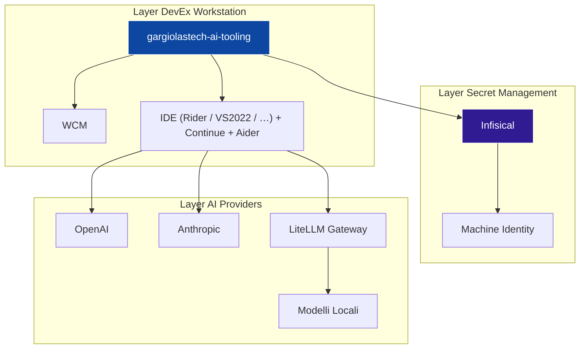
```mermaid
flowchart TB
    subgraph TopLayer["Layer DevEx Workstation"]
        AT["gargiolastech-ai-tooling"]
        Cred["WCM"]
        IDE["IDE (Rider / VS2022 / …) + Continue + Aider"]
    end

    subgraph MiddleLayer["Layer Secret Management"]
        INF["Infisical"]
        MI["Machine Identity"]
    end

    subgraph BottomLayer["Layer AI Providers"]
        OAI["OpenAI"]
        ANT["Anthropic"]
        LLM["LiteLLM Gateway"]
        LOC["Modelli Locali"]
    end

    AT --> Cred
    AT --> IDE
    AT --> INF
    INF --> MI
    IDE --> OAI
    IDE --> ANT
    IDE --> LLM
    LLM --> LOC

    style AT fill:#0d47a1,stroke:#fff,color:#fff
    style INF fill:#311b92,stroke:#fff,color:#fff
```

---

## 3. Architecture Overview

### 3.1 Modello a layer

L'architettura è organizzata in **cinque layer logici**, ciascuno con responsabilità chiaramente delimitate. La separazione segue il principio di **single source of truth** per ciascun tipo di artefatto.

| Layer | Responsabilità | Source of Truth | Persistenza |
|---|---|---|---|
| **L1 — Repository Git** | Template, script, configurazioni non sensibili, prompt | GitHub | Permanente (versionata) |
| **L2 — Configurazione utente** | `projects.json` con mapping progetti → identità Infisical | Filesystem utente | Permanente (locale, non versionata) |
| **L3 — Credential Bootstrap** | Client ID + Client Secret Machine Identity | Windows Credential Manager (DPAPI) | Permanente cifrata (locale, OS-protected) |
| **L4 — Secret Store** | Tutti i segreti AI (API keys, endpoint, modelli) | Infisical | Centralizzata, cloud o self-hosted |
| **L5 — Runtime ephemeral** | File `.env` consumati dagli strumenti AI | Filesystem utente | **Effimera** (rigenerata ad ogni avvio) |

### 3.2 Diagramma architetturale completo

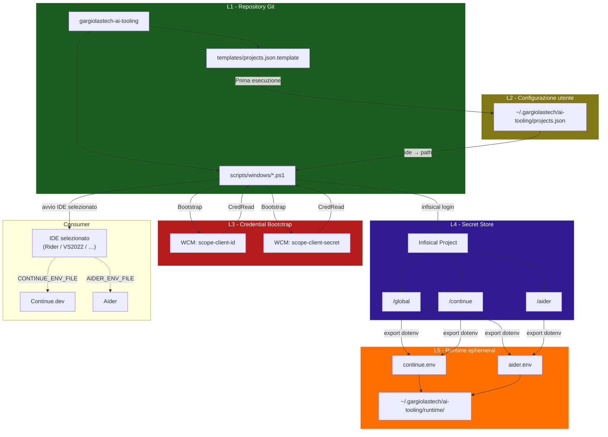
```mermaid
flowchart TB
    subgraph L1["L1 - Repository Git"]
        REPO["gargiolastech-ai-tooling"]
        TPL["templates/projects.json.template"]
        SCRIPTS["scripts/windows/*.ps1"]
    end

    subgraph L2["L2 - Configurazione utente"]
        CFG["~/.gargiolastech/ai-tooling/projects.json"]
    end

    subgraph L3["L3 - Credential Bootstrap"]
        WCM_ID["WCM: scope-client-id"]
        WCM_SECRET["WCM: scope-client-secret"]
    end

    subgraph L4["L4 - Secret Store"]
        INF["Infisical Project"]
        GLOBAL["/global"]
        CONT_PATH["/continue"]
        AIDER_PATH["/aider"]
    end

    subgraph L5["L5 - Runtime ephemeral"]
        RUN_DIR["~/.gargiolastech/ai-tooling/runtime/"]
        CONT_ENV["continue.env"]
        AIDER_ENV["aider.env"]
    end

    subgraph CONSUMERS["Consumer"]
        IDE["IDE selezionato<br/>(Rider / VS2022 / …)"]
        CONT["Continue.dev"]
        AIDER["Aider"]
    end

    REPO --> TPL
    REPO --> SCRIPTS
    TPL -->|"Prima esecuzione"| CFG
    SCRIPTS -->|"Bootstrap"| WCM_ID
    SCRIPTS -->|"Bootstrap"| WCM_SECRET
    WCM_ID -->|"CredRead"| SCRIPTS
    WCM_SECRET -->|"CredRead"| SCRIPTS
    SCRIPTS -->|"infisical login"| INF
    INF --> GLOBAL
    INF --> CONT_PATH
    INF --> AIDER_PATH
    GLOBAL -->|"export dotenv"| CONT_ENV
    CONT_PATH -->|"export dotenv"| CONT_ENV
    GLOBAL -->|"export dotenv"| AIDER_ENV
    AIDER_PATH -->|"export dotenv"| AIDER_ENV
    CONT_ENV --> RUN_DIR
    AIDER_ENV --> RUN_DIR
    CFG -->|"ide → path"| SCRIPTS
    SCRIPTS -->|"avvio IDE selezionato"| IDE
    IDE -.->|"CONTINUE_ENV_FILE"| CONT
    IDE -.->|"AIDER_ENV_FILE"| AIDER

    style L1 fill:#1b5e20,stroke:#fff,color:#fff
    style L2 fill:#827717,stroke:#fff,color:#fff
    style L3 fill:#b71c1c,stroke:#fff,color:#fff
    style L4 fill:#311b92,stroke:#fff,color:#fff
    style L5 fill:#ff6f00,stroke:#fff,color:#fff
```

### 3.3 Principi architetturali fondamentali

| Principio | Applicazione concreta |
|---|---|
| **Zero Secrets in Repo** | Il repository è scansionabile con qualsiasi tool (GitLeaks, TruffleHog) e produce zero hit. |
| **Defense in Depth** | Per esfiltrare i segreti AI un attaccante deve compromettere: (a) workstation, (b) sessione utente Windows, (c) Machine Identity Infisical, (d) policy di accesso ai path Infisical. |
| **Least Privilege** | Ogni Machine Identity ha accesso solo ai path Infisical strettamente necessari (`/global`, `/continue`, `/aider`) e solo per l'environment dichiarato (es. `dev`). |
| **Ephemeral by Default** | Ogni segreto materializzato sul disco è considerato compromesso al successivo avvio: si rigenera. |
| **Idempotency** | Tutti gli script possono essere eseguiti N volte senza side-effect cumulativi. |
| **Compile-time Safety** | Nessuno script usa pattern dinamici tipo `Invoke-Expression`. La pipeline è completamente statica e ispezionabile. |

---

## 4. Complete Runtime Flow

Questa sezione descrive **l'intero ciclo di vita** di una sessione di sviluppo, dall'icona sul desktop fino alla disponibilità dei segreti dentro Continue e Aider in Rider.

### 4.1 Sequence diagram completo

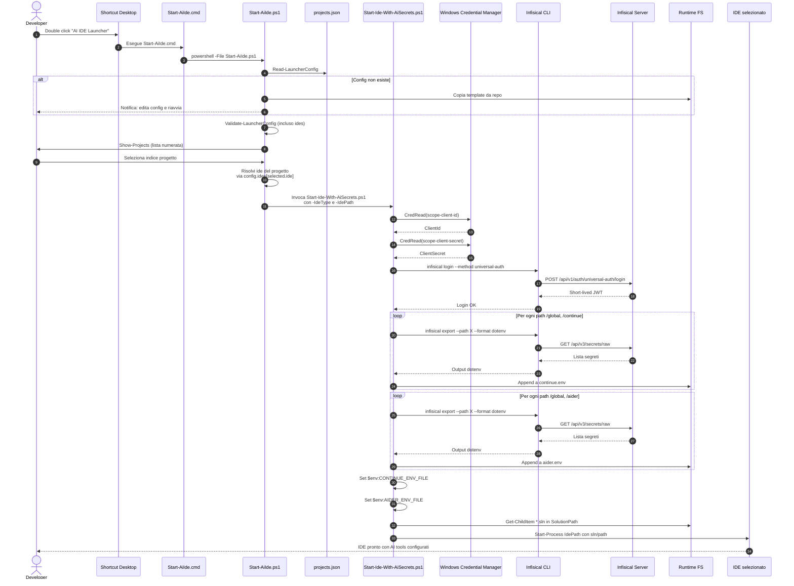
```mermaid
sequenceDiagram
    autonumber
    actor Dev as Developer
    participant Desktop as Shortcut Desktop
    participant CMD as Start-AiIde.cmd
    participant PS1 as Start-AiIde.ps1
    participant CFG as projects.json
    participant Engine as Start-Ide-With-AiSecrets.ps1
    participant WCM as Windows Credential Manager
    participant CLI as Infisical CLI
    participant INF as Infisical Server
    participant FS as Runtime FS
    participant IDE as IDE selezionato

    Dev->>Desktop: Double click "AI IDE Launcher"
    Desktop->>CMD: Esegue Start-AiIde.cmd
    CMD->>PS1: powershell -File Start-AiIde.ps1
    PS1->>CFG: Read-LauncherConfig
    alt Config non esiste
        PS1->>FS: Copia template da repo
        PS1-->>Dev: Notifica: edita config e riavvia
    end
    PS1->>PS1: Validate-LauncherConfig (incluso ides)
    PS1->>Dev: Show-Projects (lista numerata)
    Dev->>PS1: Seleziona indice progetto
    PS1->>PS1: Risolvi ide del progetto<br/>via config.ides[selected.ide]
    PS1->>Engine: Invoca Start-Ide-With-AiSecrets.ps1<br/>con -IdeType e -IdePath
    Engine->>WCM: CredRead(scope-client-id)
    WCM-->>Engine: ClientId
    Engine->>WCM: CredRead(scope-client-secret)
    WCM-->>Engine: ClientSecret
    Engine->>CLI: infisical login --method universal-auth
    CLI->>INF: POST /api/v1/auth/universal-auth/login
    INF-->>CLI: Short-lived JWT
    CLI-->>Engine: Login OK
    loop Per ogni path /global, /continue
        Engine->>CLI: infisical export --path X --format dotenv
        CLI->>INF: GET /api/v3/secrets/raw
        INF-->>CLI: Lista segreti
        CLI-->>Engine: Output dotenv
        Engine->>FS: Append a continue.env
    end
    loop Per ogni path /global, /aider
        Engine->>CLI: infisical export --path X --format dotenv
        CLI->>INF: GET /api/v3/secrets/raw
        INF-->>CLI: Lista segreti
        CLI-->>Engine: Output dotenv
        Engine->>FS: Append a aider.env
    end
    Engine->>Engine: Set $env:CONTINUE_ENV_FILE
    Engine->>Engine: Set $env:AIDER_ENV_FILE
    Engine->>FS: Get-ChildItem *.sln in SolutionPath
    Engine->>IDE: Start-Process IdePath con sln/path
    IDE-->>Dev: IDE pronto con AI tools configurati
```

### 4.2 Stadi del flusso runtime

| # | Stadio | Trigger | Durata tipica | Failure mode |
|---|---|---|---|---|
| 1 | Avvio shortcut | Click utente | <100ms | Nessuno significativo |
| 2 | Bootstrap PowerShell | Esecuzione `.cmd` | 200-500ms | ExecutionPolicy errata |
| 3 | Lettura configurazione | I/O filesystem | <50ms | JSON malformato, file mancante |
| 4 | Validazione configurazione (incluso `ides`) | In-memory | <10ms | Campo obbligatorio mancante, `ides` non definito |
| 5 | Selezione progetto | Input utente | Variabile | Indice non valido |
| 6 | Risoluzione IDE del progetto | Lookup in `config.ides[selected.ide]` | <10ms | `ide` non valorizzato, IDE non configurato, path non esistente |
| 7 | Lettura WCM | P/Invoke `Advapi32.dll` | <50ms | Credenziale assente |
| 8 | Login Infisical | HTTP POST | 200-800ms | ClientId/Secret invalidi, rete |
| 9 | Export segreti (4 chiamate) | HTTP GET × 4 | 400-1500ms | Path non esistente, scope mancante |
| 10 | Setup env runtime | Filesystem write | <50ms | Permessi negati |
| 11 | Lancio IDE | Process spawn | 50-200ms | Eseguibile non trovato |

**Tempo totale tipico end-to-end:** 1.5 – 3.5 secondi.

---

## 5. Security Architecture

### 5.1 Threat Model

Identifichiamo gli attori malevoli e i vettori d'attacco rilevanti.

#### 5.1.1 Attori

| Attore | Capacità | Mitigazione |
|---|---|---|
| **External Attacker (remote)** | Accesso ai repository pubblici, internet | Nessun segreto è mai in repo |
| **Insider — Developer altro team** | Accesso al repository git | Repository contiene solo template non sensibili |
| **Insider — Stagista/collaboratore** | Accesso temporaneo alla workstation | Machine Identity per developer, revoca puntuale |
| **Compromised CI Runner** | Token GitHub Actions, accesso al repo | Repository inerte; nessuna pipeline ha bisogno dei segreti AI |
| **Malware sulla workstation** | Esecuzione locale come utente | DPAPI protegge WCM; segreti effimeri minimizzano la finestra di esposizione |
| **Stolen Laptop (offline)** | Accesso fisico, file system | Profilo Windows cifrato con BitLocker + DPAPI |

#### 5.1.2 Vettori d'attacco e mitigazioni

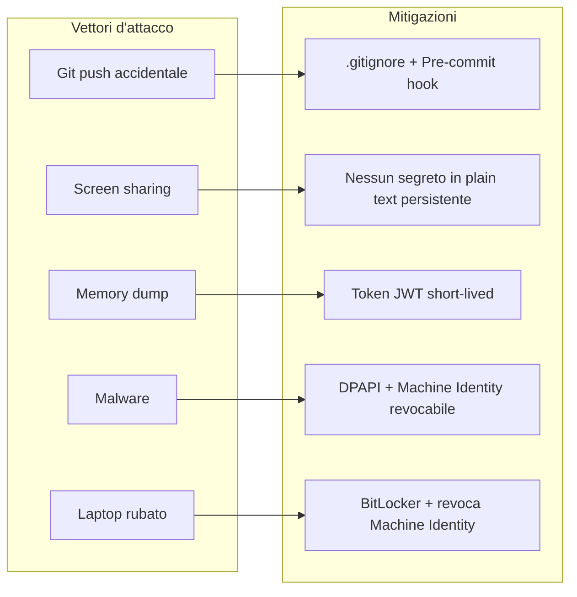
```mermaid
flowchart LR
    subgraph Attack["Vettori d'attacco"]
        A1["Git push accidentale"]
        A2["Screen sharing"]
        A3["Memory dump"]
        A4["Malware"]
        A5["Laptop rubato"]
    end

    subgraph Mitigation["Mitigazioni"]
        M1[".gitignore + Pre-commit hook"]
        M2["Nessun segreto in plain text persistente"]
        M3["Token JWT short-lived"]
        M4["DPAPI + Machine Identity revocabile"]
        M5["BitLocker + revoca Machine Identity"]
    end

    A1 --> M1
    A2 --> M2
    A3 --> M3
    A4 --> M4
    A5 --> M5
```

### 5.2 Confini di sicurezza (Security Boundaries)

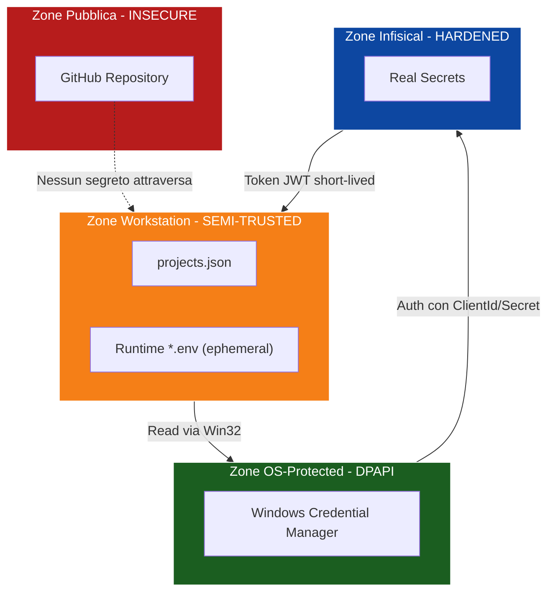
```mermaid
flowchart TB
    subgraph PublicZone["Zone Pubblica - INSECURE"]
        REPO["GitHub Repository"]
    end

    subgraph WorkstationZone["Zone Workstation - SEMI-TRUSTED"]
        CFG["projects.json"]
        ENV["Runtime *.env (ephemeral)"]
    end

    subgraph OSZone["Zone OS-Protected - DPAPI"]
        WCM["Windows Credential Manager"]
    end

    subgraph CloudZone["Zone Infisical - HARDENED"]
        SECRETS["Real Secrets"]
    end

    REPO -.->|"Nessun segreto attraversa"| WorkstationZone
    WorkstationZone -->|"Read via Win32"| OSZone
    OSZone -->|"Auth con ClientId/Secret"| CloudZone
    CloudZone -->|"Token JWT short-lived"| WorkstationZone

    style PublicZone fill:#b71c1c,stroke:#fff,color:#fff
    style WorkstationZone fill:#f57f17,stroke:#fff,color:#fff
    style OSZone fill:#1b5e20,stroke:#fff,color:#fff
    style CloudZone fill:#0d47a1,stroke:#fff,color:#fff
```

### 5.3 Cosa attraversa quale confine

| Artefatto | Pubblico (Git) | Workstation (FS) | OS-Protected (WCM) | Cloud (Infisical) |
|---|:---:|:---:|:---:|:---:|
| Template `projects.json` | ✅ | ✅ | ❌ | ❌ |
| Script `.ps1` / `.cmd` | ✅ | ✅ | ❌ | ❌ |
| `projects.json` configurato | ❌ | ✅ | ❌ | ❌ |
| Machine Identity Client ID | ❌ | ❌ | ✅ | ✅ (issued) |
| Machine Identity Client Secret | ❌ | ❌ | ✅ | ✅ (verified) |
| API Key OpenAI / Anthropic | ❌ | ⚠️ runtime only | ❌ | ✅ |
| JWT token Infisical | ❌ | 🟡 in-memory | ❌ | ✅ |

Legenda: ✅ presente · ❌ mai presente · ⚠️ presente solo in modo effimero · 🟡 in-memory only

---

## 6. Perché viene utilizzata la Machine Identity

### 6.1 Alternative considerate e scartate

Infisical offre diversi modelli di autenticazione. Vediamo perché la **Machine Identity con Universal Auth** è stata selezionata.

| Metodo | Descrizione | Perché scartato |
|---|---|---|
| **Service Token (legacy)** | Token statico opaco, lunga durata | Token deprecato da Infisical, non revocabile granularmente, no audit dettagliato |
| **User Login (browser-based)** | Login interattivo con SSO/email | Richiede interazione umana ad ogni avvio, non automatizzabile, accoppia identità developer a strumenti automatici |
| **API Key personale** | Chiave personale dell'utente | Lega i segreti AI al singolo developer: se il developer lascia l'azienda, l'intera pipeline si rompe |
| **AWS IAM Auth / Kubernetes Auth** | Auth federata da cloud provider | Non applicabile: la workstation Windows non ha identità AWS/K8s nativa |
| **OIDC Auth** | Auth via provider OIDC | Overkill per developer workstation, richiede setup IdP federato |
| **Machine Identity (Universal Auth)** ✅ | Identità separata da utente, ClientId+Secret, scope granulare | Disaccoppia identità tecnica da identità umana, supporta rotazione, supporta IP allow-list, audit log per identity |

### 6.2 Proprietà tecniche della Machine Identity

La **Machine Identity** in Infisical è una *prima-class identity* del sistema RBAC, distinta dagli utenti umani. Possiede:

- **Universal Auth method**: scambio di `clientId + clientSecret` con un **JWT access token short-lived** (default: 7200 secondi, configurabile).
- **Auth-method-specific configuration**:
  - **Client Secret TTL**: durata del *secret di scambio* (di default illimitato, ma può essere configurato per forzare rotazione).
  - **Access Token TTL**: durata del JWT effettivo restituito al login.
  - **Access Token Max TTL**: durata massima cumulativa del JWT prima che richieda un re-login.
  - **Access Token Number of Uses Limit**: numero massimo di chiamate API per token (default illimitato).
  - **Client Secret Trusted IPs**: lista CIDR di IP autorizzati a scambiare il secret per un token.
  - **Access Token Trusted IPs**: lista CIDR autorizzati a usare il token JWT emesso.
- **Role binding**: la Machine Identity viene assegnata a uno o più progetti Infisical con un **role** (es. `developer`, `viewer`) o un **custom role** con permessi granulari su path specifici.
- **Auditabilità**: ogni operazione viene loggata con `identityId` distinto da `userId`.

### 6.3 Decoupling vantaggi

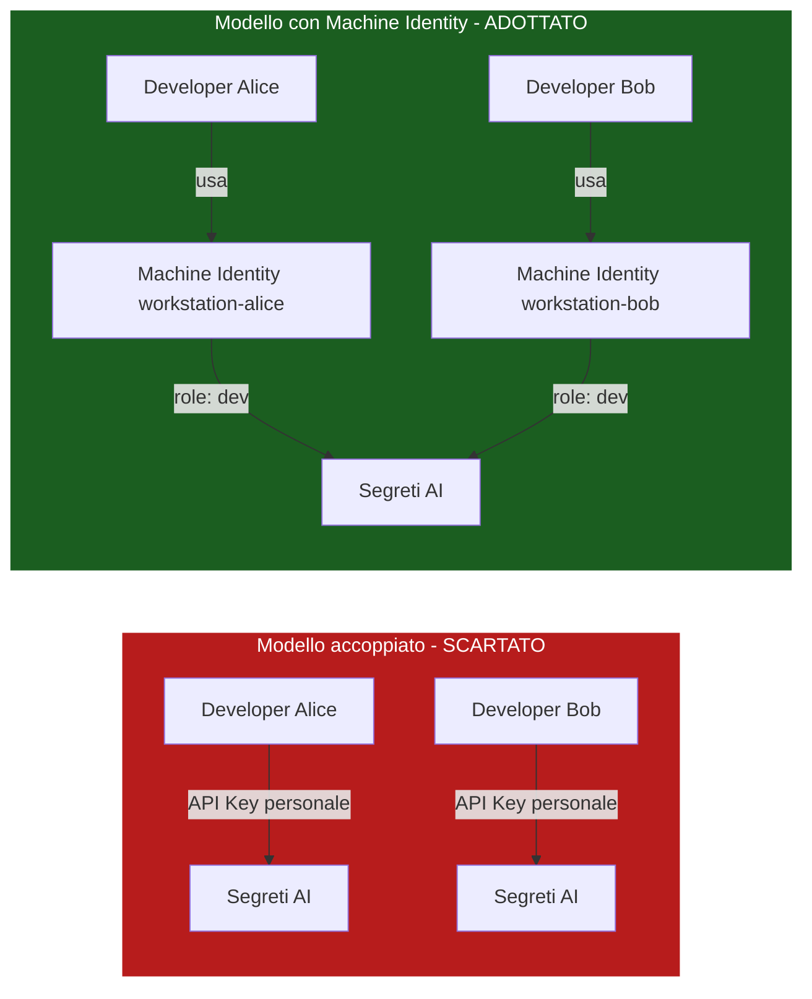
```mermaid
flowchart LR
    subgraph BadModel["Modello accoppiato - SCARTATO"]
        Dev1["Developer Alice"] -->|"API Key personale"| Sec1["Segreti AI"]
        Dev2["Developer Bob"] -->|"API Key personale"| Sec2["Segreti AI"]
    end

    subgraph GoodModel["Modello con Machine Identity - ADOTTATO"]
        Dev3["Developer Alice"] -->|"usa"| MI1["Machine Identity workstation-alice"]
        Dev4["Developer Bob"] -->|"usa"| MI2["Machine Identity workstation-bob"]
        MI1 -->|"role: dev"| Sec3["Segreti AI"]
        MI2 -->|"role: dev"| Sec3
    end

    style BadModel fill:#b71c1c,stroke:#fff,color:#fff
    style GoodModel fill:#1b5e20,stroke:#fff,color:#fff
```

**Vantaggi del modello adottato:**

1. **Revoca granulare**: revocare l'accesso di Bob non impatta Alice.
2. **Audit puntuale**: log distinti per ogni workstation/developer.
3. **Lifecycle indipendente**: Alice cambia team → si revoca la sua Machine Identity, non si toccano i segreti.
4. **Rotazione del Client Secret** senza dover ridistribuire l'intero set di segreti AI: la rotazione è locale, lato Infisical + workstation, e gli AI provider non vedono alcun cambiamento.
5. **IP Allow-list**: si possono restringere le Machine Identity a range IP aziendali (VPN), aggiungendo un secondo fattore implicito.

### 6.4 Confronto teorico: User vs Machine Identity

| Proprietà | User Identity | Machine Identity |
|---|---|---|
| Trigger di creazione | Onboarding HR | Provisioning IT/Platform |
| Numero per developer | Esattamente uno | Uno o più (per workstation, per CI, per progetto) |
| Lifecycle | Legato al rapporto di lavoro | Indipendente |
| Auth method | SSO, email/password, MFA | ClientId/Secret, OIDC, K8s, AWS |
| Granularità revoca | Tutto-o-niente | Per-identità |
| Adatto a script automatici | ❌ Auth interattiva | ✅ Non interattiva |

---

## 7. Perché il solo Project ID non è sufficiente

### 7.1 Equivoco frequente

Una domanda ricorrente da parte di chi vede per la prima volta `projects.json` è:

> *"Se il `infisicalProjectId` è scritto in chiaro nel file di configurazione, allora il Project ID è la chiave d'accesso. Perché serve anche la Machine Identity?"*

La risposta richiede di distinguere **identificazione** da **autenticazione**:

| Concetto | Cos'è | Esempio |
|---|---|---|
| **Identificazione** | "Quale risorsa voglio raggiungere?" | Project ID |
| **Autenticazione** | "Chi sono io che voglio raggiungerla?" | Client ID + Secret |
| **Autorizzazione** | "Cosa mi è permesso fare lì?" | Role bound to identity |

Il **Project ID è solo un identificatore di risorsa**, esattamente come un account number bancario: conoscerlo non dà alcun diritto. È pubblico per design: appare nelle URL della web UI di Infisical, nei log, nelle configurazioni applicative.

### 7.2 Cosa succederebbe se l'API accettasse il solo Project ID

Sarebbe un *broken access control* di livello catastrofico:

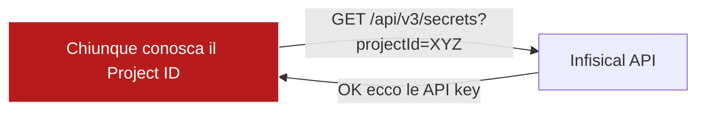
```mermaid
flowchart LR
    Attacker["Chiunque conosca il Project ID"] -->|"GET /api/v3/secrets?projectId=XYZ"| API["Infisical API"]
    API -->|"OK ecco le API key"| Attacker

    style Attacker fill:#b71c1c,stroke:#fff,color:#fff
```

Equivarrebbe ad avere una cassaforte con un'etichetta sul fronte ("conto cliente 12345") e zero combinazione: chiunque legga l'etichetta apre la cassaforte.

### 7.3 Cosa rappresenta veramente il Project ID nella nostra architettura

Il `infisicalProjectId` in `projects.json` serve a:

1. **Discriminare il progetto target** quando un singolo developer ha più progetti (es. `wcm`, `quoteflow`).
2. **Permettere al launcher di parametrizzare la chiamata** `infisical export --projectId X`.
3. **Esplicitare in configurazione locale** la corrispondenza progetto IDE ↔ progetto Infisical, in modo che cambiare progetto sia una modifica di configurazione, non di codice.

Il Project ID **non è un segreto** e può essere:

- visualizzato in screenshot di documentazione interna;
- discusso in canali Slack di team;
- presente in eventuali log applicativi.

### 7.4 Diagramma del controllo accessi reale

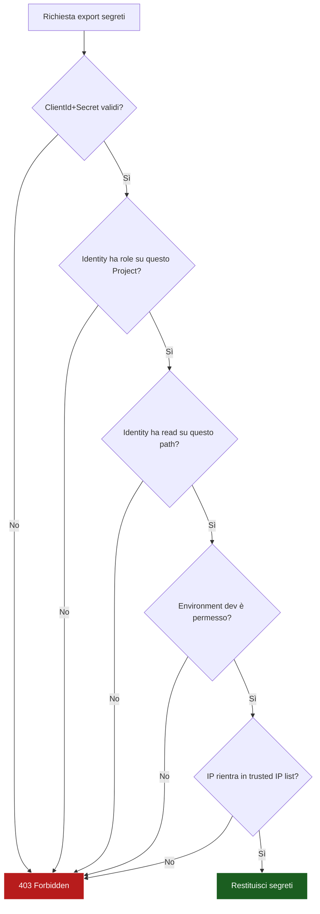
```mermaid
flowchart TB
    Request["Richiesta export segreti"]
    Q1{"ClientId+Secret validi?"}
    Q2{"Identity ha role su questo Project?"}
    Q3{"Identity ha read su questo path?"}
    Q4{"Environment dev è permesso?"}
    Q5{"IP rientra in trusted IP list?"}
    Allow["Restituisci segreti"]
    Deny["403 Forbidden"]

    Request --> Q1
    Q1 -->|No| Deny
    Q1 -->|Sì| Q2
    Q2 -->|No| Deny
    Q2 -->|Sì| Q3
    Q3 -->|No| Deny
    Q3 -->|Sì| Q4
    Q4 -->|No| Deny
    Q4 -->|Sì| Q5
    Q5 -->|No| Deny
    Q5 -->|Sì| Allow

    style Allow fill:#1b5e20,stroke:#fff,color:#fff
    style Deny fill:#b71c1c,stroke:#fff,color:#fff
```

Il Project ID è un **input** a una catena di controlli, **non** il controllo stesso.

---

## 8. Perché viene utilizzato Windows Credential Manager

### 8.1 Il problema del "chicken-and-egg" delle credenziali

Per ottenere i segreti AI da Infisical, ci serve la Machine Identity (ClientId + ClientSecret). Ma **dove memorizziamo la Machine Identity stessa?** Abbiamo opzioni:

| Opzione | Problema |
|---|---|
| In un file `.env` nel repo | I segreti sono in repo: violiamo il principio architetturale fondante |
| In un file `.env` locale (es. `~/.infisical-creds`) | Plain text, accessibile a qualsiasi processo dell'utente, esposto a malware userland, mostrato in screenshot/screen sharing |
| In variabili d'ambiente utente | Persistenti in plain text nel registry HKCU, ereditate da ogni processo figlio, leakkate facilmente |
| In un secret manager di terze parti (1Password CLI, Bitwarden, etc.) | Aggiunge dipendenza esterna, costo licenza, prompt biometrico ad ogni avvio |
| In **Windows Credential Manager (DPAPI)** ✅ | Cifratura at-rest, key derivata dal profilo utente Windows, no plain text su disco, no dipendenze esterne, già presente nell'OS |

### 8.2 Cos'è Windows Credential Manager (WCM)

WCM è un componente nativo di Windows (dal 2000/XP) che gestisce uno **store cifrato per credenziali**. Espone:

- **Comando utente:** `cmdkey` (CLI) e Pannello di Controllo → Gestione credenziali (GUI).
- **API Win32:** `CredRead`, `CredWrite`, `CredDelete` (in `Advapi32.dll`).
- **Tipi di credenziale supportati:** `CRED_TYPE_GENERIC` (quello che usiamo), `CRED_TYPE_DOMAIN_PASSWORD`, `CRED_TYPE_CERTIFICATE`, etc.
- **Persistenza:** locale, con backing **DPAPI (Data Protection API)** per la cifratura.

### 8.3 Modello di sicurezza di DPAPI

**DPAPI** (Data Protection API) è il meccanismo di crittografia nativo di Windows. La chiave di cifratura è **derivata dalle credenziali di logon dell'utente**, attraverso un processo che combina:

- la password dell'utente (o hash NTLM nel caso di account locali);
- un master key file specifico dell'utente in `%APPDATA%\Microsoft\Protect\<SID>\`;
- entropy aggiuntiva opzionale.

Conseguenze pratiche:

1. **Cross-user isolation**: l'utente `bob` su Windows non può decifrare le credenziali memorizzate da `alice` sulla stessa macchina, anche con permessi admin (a meno di attacchi mirati al master key file dell'altro utente).
2. **Cross-machine isolation**: copiare il file delle credenziali su un'altra macchina non basta: serve anche il master key file e la password dell'utente.
3. **No plain text on disk**: anche con accesso fisico al disco (laptop spento, hard disk estratto), in assenza di BitLocker e della password dell'utente, le credenziali sono inutilizzabili.
4. **Integrazione con la sessione**: le credenziali sono accessibili **solo quando l'utente è loggato**, non da servizi che girano con altri account (a meno di configurazione esplicita).

### 8.4 Esempio di interazione P/Invoke

Lo script `Start-Ide-With-AiSecrets.ps1` usa **direttamente le Win32 API** via P/Invoke `Add-Type`, **senza dipendenze da moduli PowerShell esterni**:

```csharp
[DllImport("Advapi32.dll", EntryPoint = "CredReadW", CharSet = CharSet.Unicode, SetLastError = true)]
private static extern bool CredRead(
    string target,
    int type,
    int reservedFlag,
    out IntPtr credentialPtr);
```

**Perché non usare il modulo `CredentialManager` di PowerShell Gallery?**

| Considerazione | P/Invoke diretto | Modulo esterno |
|---|---|---|
| Dipendenza aggiuntiva | ❌ nessuna | ✅ richiede `Install-Module` |
| Approvazione SecOps | Banale: usa OS API | Richiede review del modulo |
| Supply chain risk | Zero | Pacchetto NuGet/PowerShellGallery |
| Performance | Diretta | Wrapper overhead |
| Portabilità script in ambienti restricted | Funziona | Può fallire se ExecutionPolicy o offline |

Questa è una **scelta enterprise-grade**: zero supply chain risk, zero dipendenze fuori dall'OS.

### 8.5 Struttura del target name

Le credenziali WCM sono identificate da una stringa chiamata **target name**, che funge da chiave univoca. Lo script adotta una convenzione strutturata:

```
<CredentialScope>-<role>
```

Esempi:

```
gargiolastech-ai-tooling-dev-client-id
gargiolastech-ai-tooling-dev-client-secret
```

Vantaggi della convenzione:

- **Namespacing**: il prefisso `gargiolastech-ai-tooling-dev` evita collisioni con altre app.
- **Multi-environment**: cambiando lo scope (`...-staging`, `...-prod`), si supportano più Machine Identity per la stessa workstation.
- **Discoverability**: `cmdkey /list:gargiolastech-ai-tooling-dev-*` rivela tutte le credenziali correlate.

### 8.6 Limiti noti e mitigazioni

| Limite | Impatto | Mitigazione |
|---|---|---|
| `cmdkey /pass:` espone il secret nella process list per <1s | Memory dump o monitoring tool durante il bootstrap potrebbe catturare il secret | Eseguire il bootstrap su workstation pulita; rotare il secret dopo il bootstrap iniziale |
| DPAPI key vincolata all'utente | Reinstallazione di Windows → credenziali perse → re-bootstrap obbligatorio | Documentazione esplicita; ricreazione è idempotente in <30s |
| Niente sync cross-device nativo | Cambio laptop = re-bootstrap | Coerente con il modello "Machine Identity per workstation" |

---

## 9. Perché i file env runtime sono temporanei

### 9.1 Definizione operativa di "runtime ephemeral"

Nel contesto di questa architettura, un file è **runtime ephemeral** se rispetta queste proprietà:

1. **Generato just-in-time**: viene scritto immediatamente prima dell'uso.
2. **Sovrascritto ad ogni esecuzione**: nessuna logica di "merge" con la versione precedente.
3. **Localizzato fuori dal repo**: vive in `~/.gargiolastech/ai-tooling/runtime/`, non in workspace.
4. **Non versionato**: nessun strumento (Git, backup) lo include nei suoi flussi.
5. **Concettualmente sostituibile**: il sistema deve poter funzionare se viene eliminato manualmente (al prossimo avvio si rigenera).

### 9.2 Perché non scrivere segreti AI in WCM direttamente

Alternativa scartata: invece di esportare i segreti AI in file `.env`, potremmo memorizzarli in WCM allo stesso modo del Client ID/Secret. **Perché non lo facciamo?**

| Considerazione | File .env runtime | Segreti in WCM |
|---|---|---|
| Consumabilità da Continue/Aider | ✅ Continue legge `CONTINUE_ENV_FILE` nativamente | ❌ Richiederebbe wrapper personalizzati per ogni tool |
| Aggiornabilità (rotazione segreti AI) | ✅ Cancello e rigenero | ⚠️ Sync continuo necessario |
| Numero di segreti supportati | Illimitato | Conveniente fino a ~10, oltre diventa scomodo |
| Single source of truth | ✅ Infisical | ❌ WCM diventa cache che può divergere |

La regola operativa è: **WCM contiene solo le credenziali di accesso a Infisical. Infisical contiene tutto il resto.**

### 9.3 Lifecycle dei file runtime

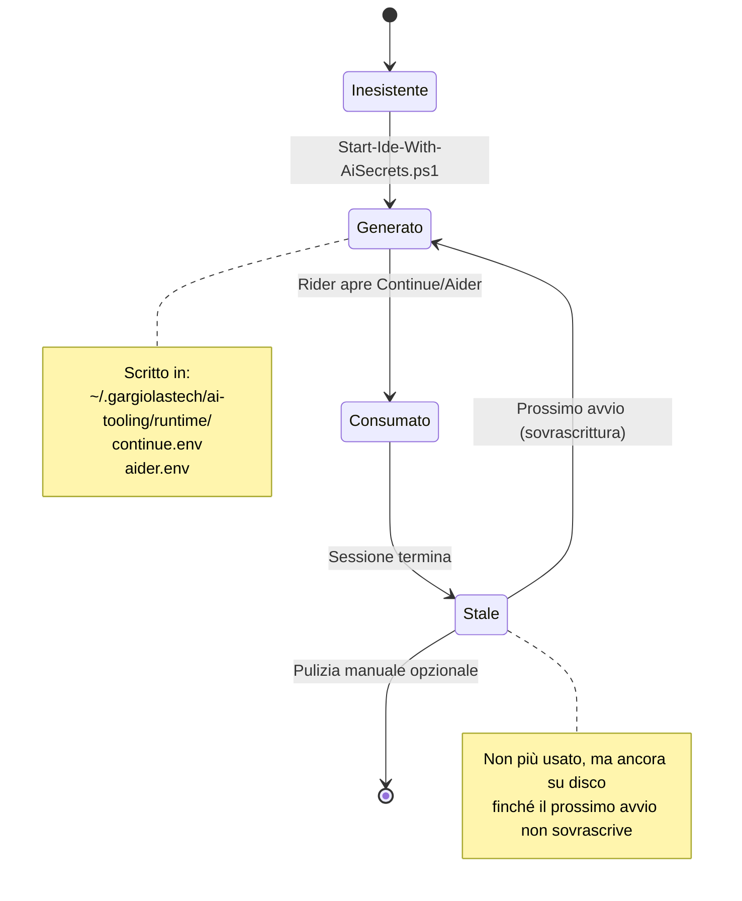
```mermaid
stateDiagram-v2
    [*] --> Inesistente
    Inesistente --> Generato : Start-Ide-With-AiSecrets.ps1
    Generato --> Consumato : Rider apre Continue/Aider
    Consumato --> Stale : Sessione termina
    Stale --> Generato : Prossimo avvio (sovrascrittura)
    Stale --> [*] : Pulizia manuale opzionale

    note right of Generato
        Scritto in:
        ~/.gargiolastech/ai-tooling/runtime/
        continue.env
        aider.env
    end note

    note right of Stale
        Non più usato, ma ancora su disco
        finché il prossimo avvio non sovrascrive
    end note
```

### 9.4 Vantaggi della temporaneità

1. **Finestra di esposizione minimizzata**: un attaccante che acquisisce filesystem access **dopo** la chiusura dell'IDE trova file con segreti scaduti/ruotati, riducendo l'impatto del leak.
2. **Auto-healing su rotazione**: quando si ruotano le API key AI in Infisical, il prossimo avvio dell'IDE propaga automaticamente i nuovi valori. Zero intervento manuale.
3. **Coerenza obbligata**: il file `.env` runtime non può divergere da Infisical, perché viene rigenerato da Infisical ad ogni esecuzione.
4. **Onboarding/offboarding semplici**: per disabilitare un developer, basta revocare la Machine Identity. I file `.env` locali sull'ex workstation diventano inutili al primo avvio (login fallirà).

### 9.5 Trade-off: cosa succede se il computer è offline?

**Limitazione consapevole**: se la rete è giù, il launcher fallisce. Non c'è cache fallback.

Questo è un trade-off **deliberato**: il valore di sicurezza di non avere file `.env` persistenti supera la disponibilità in scenari edge (developer in aereo). Casi documentati di lavoro offline sono mitigati dalla gestione utente:

- l'utente può **lasciare aperto Rider** (i tools AI continueranno a funzionare con i segreti già caricati nella sessione corrente);
- l'utente può **temporaneamente** copiare gli `.env` runtime in una posizione separata (decisione esplicita, non default).

### 9.6 Layout filesystem finale

```
%USERPROFILE%\.gargiolastech\ai-tooling\
├── projects.json                  ← Permanente, configurazione utente
└── runtime\                       ← Cartella dei file effimeri
    ├── continue.env               ← Sovrascritto ad ogni avvio
    └── aider.env                  ← Sovrascritto ad ogni avvio
```

---

## 10. Struttura completa del repository

### 10.1 Tree di alto livello

```
gargiolastech-ai-tooling/
├── LICENSE                          ← MIT License
├── README.md                        ← Repo-level overview con link a docs/
├── docs/
│   └── DOCUMENTATION.md             ← Questa documentazione enterprise
├── images/
│   ├── Icona.ico                    ← Icona del launcher (formato Windows shortcut)
│   └── Icona.png                    ← Versione PNG per documentazione/web
├── scripts/
│   └── windows/                     ← Tutti gli script PowerShell e CMD
│       ├── bootstrap-ai-tooling.cmd
│       ├── Install-AiIdeDesktopShortcut.ps1
│       ├── Install-Aider.cmd
│       ├── Install-Aider.ps1
│       ├── Set-InfisicalCredential.ps1
│       ├── Start-AiIde.cmd
│       ├── Start-AiIde.ps1
│       └── Start-Ide-With-AiSecrets.ps1
└── templates/
    └── projects.json.template       ← Template configurazione multi-progetto / multi-IDE
```

### 10.2 Tabella esplicativa file-per-file

| Percorso | Tipo | Responsabilità | Idempotente | Sensibile |
|---|---|---|:---:|:---:|
| `LICENSE` | Documento | Termini di licenza (MIT) | — | ❌ |
| `README.md` | Documento | Punto d'ingresso documentale + link a `docs/` | — | ❌ |
| `docs/DOCUMENTATION.md` | Documento | Documentazione tecnica enterprise completa | — | ❌ |
| `images/Icona.ico` | Asset binario | Icona del collegamento desktop (formato `.ico` richiesto da Windows) | — | ❌ |
| `images/Icona.png` | Asset binario | Versione PNG dell'icona per uso non-shortcut (es. documentazione, web) | — | ❌ |
| `scripts/windows/bootstrap-ai-tooling.cmd` | Wrapper CMD | UX-friendly wrapper su `Set-InfisicalCredential.ps1` con scope predefinito | ✅ | ❌ (interattivo) |
| `scripts/windows/Set-InfisicalCredential.ps1` | Script core | Scrive Client ID + Client Secret in WCM tramite `cmdkey` | ✅ | ❌ (riceve secret come param) |
| `scripts/windows/Install-Aider.cmd` | Wrapper CMD | Wrapper double-clickable per `Install-Aider.ps1`, propaga argomenti con `%*` | ✅ | ❌ |
| `scripts/windows/Install-Aider.ps1` | Provisioner | Installa Aider in un virtualenv Python isolato (`~/.venvs/aider-env`); supporta `-PythonVersion`, `-VenvPath`, `-ForceRecreate` | ✅ | ❌ |
| `scripts/windows/Start-AiIde.cmd` | Wrapper CMD | Lancia `Start-AiIde.ps1` bypassando ExecutionPolicy | ✅ | ❌ |
| `scripts/windows/Start-AiIde.ps1` | Launcher | Multi-project / multi-IDE chooser, valida config, risolve IDE, delega a `Start-Ide-With-AiSecrets.ps1` | ✅ | ❌ |
| `scripts/windows/Start-Ide-With-AiSecrets.ps1` | Engine | Cuore del runtime IDE-agnostic: WCM → Infisical login → export → spawn IDE | ✅ | ⚠️ (manipola segreti in-memory) |
| `scripts/windows/Install-AiIdeDesktopShortcut.ps1` | Utility | Crea collegamento desktop "AI IDE Launcher" con icona da `images/Icona.ico` | ✅ | ❌ |
| `templates/projects.json.template` | Template | Schema di configurazione multi-progetto e multi-IDE | — | ❌ |

### 10.3 Convenzioni di naming adottate

| Convenzione | Razionale |
|---|---|
| **Verb-Noun** PowerShell (`Set-InfisicalCredential`, `Start-AiIde`) | Aderenza alle linee guida Microsoft PowerShell, abilita auto-discovery |
| **Pascal Case** per `.ps1` | Standard PS community |
| **lowercase-with-dashes** per `.cmd` | Convenzione Unix-like per wrapper |
| **`-AiIde`** come suffisso (precedentemente `-AiRider`) | Branding consistente IDE-agnostic, evita di legare il nome a un singolo IDE |
| **`Start-Ide-With-AiSecrets`** | Nome esplicito sull'azione + sull'iniezione dei segreti |

### 10.4 Granularità degli script: perché 3 script invece di 1 monolitico

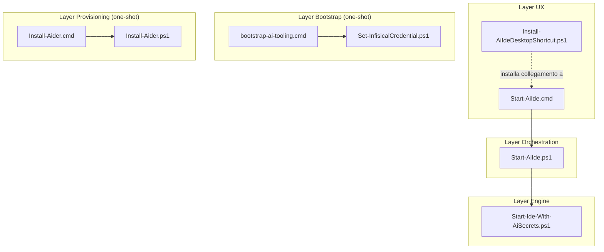
```mermaid
flowchart TB
    subgraph LayerUX["Layer UX"]
        CMD["Start-AiIde.cmd"]
        SHORT["Install-AiIdeDesktopShortcut.ps1"]
    end

    subgraph LayerOrch["Layer Orchestration"]
        LAUNCH["Start-AiIde.ps1"]
    end

    subgraph LayerEngine["Layer Engine"]
        ENG["Start-Ide-With-AiSecrets.ps1"]
    end

    subgraph LayerBootstrap["Layer Bootstrap (one-shot)"]
        BOOT["bootstrap-ai-tooling.cmd"]
        SETCRED["Set-InfisicalCredential.ps1"]
    end

    subgraph LayerProvisioning["Layer Provisioning (one-shot)"]
        AIDERCMD["Install-Aider.cmd"]
        AIDERPS["Install-Aider.ps1"]
    end

    CMD --> LAUNCH
    SHORT -.->|"installa collegamento a"| CMD
    LAUNCH --> ENG
    BOOT --> SETCRED
    AIDERCMD --> AIDERPS
```

**Responsabilità separate**:

- **UX Layer**: si occupa solo di doppio-click ed exit code utenti-friendly.
- **Orchestration Layer**: legge config, valida, sceglie il progetto, chiama l'engine.
- **Engine Layer**: parlare con WCM, Infisical, filesystem runtime e lanciare Rider.
- **Bootstrap Layer**: scritto una sola volta nella vita di una workstation; isolato per chiarezza operativa. Memorizza le credenziali Machine Identity in WCM.
- **Provisioning Layer**: prepara le dipendenze runtime (Aider in virtualenv Python). Eseguito una volta per workstation; rieseguibile per upgrade.

Vantaggi:

1. **Testabilità**: l'engine può essere invocato direttamente da CI o test manuali, bypassando la UX.
2. **Riutilizzabilità**: il layer engine accetta parametri espliciti (`-IdeType`, `-IdePath`) ed è **IDE-agnostic** by design — può essere chiamato anche da altri orchestratori (futuro: VS Code launcher, JetBrains Toolbox plugin) semplicemente passando il path dell'eseguibile target.
3. **Single Responsibility**: ogni script ha un solo motivo per cambiare.
4. **Failure isolation**: un errore nel layer UX (es. encoding CMD) non confonde il debug del layer engine.


---

## 11. Tutorial di setup completo da zero

### 11.1 Prerequisiti

| Requisito | Versione minima | Verifica |
|---|---|---|
| Windows 10/11 (64-bit) | 10.0.19041+ | `winver` |
| Windows PowerShell | 5.1+ | `$PSVersionTable.PSVersion` |
| Git for Windows | 2.30+ | `git --version` |
| Infisical CLI | 0.20.0+ | `infisical --version` |
| Python Launcher (`py`) + Python 3.12 | Vedi nota | `py -3.12 --version` |
| JetBrains Rider | 2024.1+ | Apertura dal menu Start |
| Account Infisical | — | Login web UI |
| Continue.dev plugin | Da JetBrains Marketplace | Installazione in Rider |
| Aider | Installato via `Install-Aider.cmd` (Sezione 11.5) | `& "$HOME\.venvs\aider-env\Scripts\aider.exe" --version` |

> **Nota Python**: il Python Launcher (`py.exe`) viene installato di default dall'installer ufficiale di Python su Windows (python.org). Lo script `Install-Aider.ps1` lo richiede per supportare workstation con più versioni di Python installate contemporaneamente. La versione esatta richiesta è parametrizzabile tramite `-PythonVersion` (default `3.12`).

### 11.2 Installazione Infisical CLI

L'opzione raccomandata su Windows è tramite **Scoop** (package manager pulito e installabile in userland senza admin):

```powershell
# Installazione di Scoop (se non presente)
Set-ExecutionPolicy -ExecutionPolicy RemoteSigned -Scope CurrentUser
irm get.scoop.sh | iex

# Aggiunta del bucket per Infisical
scoop bucket add org https://github.com/Infisical/scoop-infisical.git
scoop install infisical
```

In alternativa, download manuale dal sito ufficiale di Infisical e aggiunta di `infisical.exe` al `PATH`.

**Verifica:**

```powershell
infisical --version
# Output atteso: 0.x.y
```

### 11.3 Clonazione del repository

```powershell
$dev = "C:\dev"
New-Item -ItemType Directory -Force -Path $dev | Out-Null
cd $dev
git clone https://github.com/<org>/gargiolastech-ai-tooling.git
cd gargiolastech-ai-tooling
```

### 11.4 Procedura completa step-by-step

Vedi le sezioni dedicate:

- **Sezione 12** — creazione del progetto Infisical (web UI).
- **Sezione 13** — creazione e configurazione della Machine Identity.
- **Sezione 14** — bootstrap delle credenziali tramite `bootstrap-ai-tooling.cmd`.
- **Sezione 11.5** — installazione di Aider via `Install-Aider.cmd`.
- **Sezione 11.6** — primo avvio del launcher e configurazione `projects.json`.
- **Sezione 11.7** — installazione del collegamento desktop.

### 11.5 Installazione di Aider

Aider è un componente runtime indipendente dall'IDE (Sezione 20). Viene installato in un **virtualenv Python isolato** per evitare contaminazione del Python di sistema.

```powershell
cd C:\dev\gargiolastech-ai-tooling\scripts\windows
.\Install-Aider.cmd
```

**Output atteso (riassunto):**

```
===========================================
 GargiolasTech Aider Installer
===========================================

[INFO] Script root: C:\dev\gargiolastech-ai-tooling\scripts\windows
[INFO] Repository root: C:\dev\gargiolastech-ai-tooling

[INFO] Checking Python 3.12...
[OK] Python 3.12.x

[INFO] Creating virtualenv: C:\Users\<utente>\.venvs\aider-env
[INFO] Upgrading pip tooling...
[INFO] Installing/upgrading aider-chat...
[INFO] Verifying Aider installation...
aider 0.x.y

===========================================
 Aider installed successfully
===========================================
```

**Parametri opzionali**:

| Parametro | Default | Significato |
|---|---|---|
| `-PythonVersion` | `3.12` | Versione Python richiesta (sintassi `py -<version>`). Cambiare se la workstation usa Python 3.11 o 3.13. |
| `-VenvPath` | `$HOME\.venvs\aider-env` | Path del virtualenv. Personalizzare in caso di vincoli di storage. |
| `-ForceRecreate` | (off) | Switch: ricrea da zero il virtualenv anche se già esistente. Utile dopo upgrade di Python major. |

Esempi:

```powershell
# Versione Python diversa
.\Install-Aider.ps1 -PythonVersion 3.11

# Forza ricreazione del venv (es. dopo upgrade Python)
.\Install-Aider.ps1 -ForceRecreate

# Virtualenv in path custom
.\Install-Aider.ps1 -VenvPath "D:\tools\aider-env"
```

> Dettagli implementativi e razionale architetturale dell'installer Aider: vedi Sezione 20.6.

### 11.6 Primo avvio del launcher

Dopo aver completato il bootstrap (Sezione 14) e l'installazione di Aider (Sezione 11.5), il primo avvio del launcher crea automaticamente lo scheletro di `projects.json`:

```powershell
cd C:\dev\gargiolastech-ai-tooling\scripts\windows
.\Start-AiIde.cmd
```

**Output atteso al primo avvio:**

```
============================================================
 Configurazione creata
============================================================
È stato creato il file:
C:\Users\<utente>\.gargiolastech\ai-tooling\projects.json

Template utilizzato:
C:\dev\gargiolastech-ai-tooling\templates\projects.json.template

Modifica:
- solutionPath
- infisicalProjectId
- riderPath

Poi riesegui il launcher.
```

> **Nota**: il messaggio elenca `riderPath` come campo legacy. Nella versione corrente del template, il path dell'IDE è dichiarato nella sezione `ides` (vedi Sezione 18). Per modificare il path di Rider, intervenire su `ides.rider.path` in `projects.json`. Il messaggio dello script è solo testo informativo e non riflette il rename — il comportamento di validazione sottostante è basato sulla nuova struttura `ides`.

Il file generato va personalizzato (Sezione 18). Dopo la modifica, il successivo lancio mostrerà la lista dei progetti disponibili.

### 11.7 Installazione del collegamento desktop

```powershell
.\Install-AiIdeDesktopShortcut.ps1
```

Output:

```
Collegamento creato:
C:\Users\<utente>\Desktop\AI IDE Launcher.lnk
```

Da quel momento in poi, il workflow standard è: **doppio click sull'icona → seleziona progetto → l'IDE configurato per quel progetto si apre con i segreti AI caricati**.

---

## 12. Creazione del progetto Infisical

### 12.1 Modello organizzativo consigliato

**Un progetto Infisical per ciascun progetto applicativo**, con segmentazione interna per ambiente e per tool.

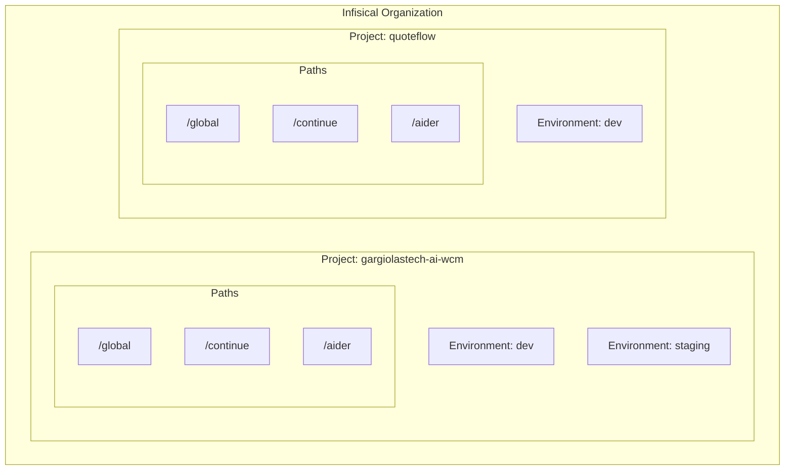
```mermaid
flowchart TB
    subgraph Org["Infisical Organization"]
        subgraph Proj1["Project: gargiolastech-ai-wcm"]
            E1Dev["Environment: dev"]
            E1Stag["Environment: staging"]
            subgraph Paths1["Paths"]
                P1A["/global"]
                P1B["/continue"]
                P1C["/aider"]
            end
        end

        subgraph Proj2["Project: quoteflow"]
            E2Dev["Environment: dev"]
            subgraph Paths2["Paths"]
                P2A["/global"]
                P2B["/continue"]
                P2C["/aider"]
            end
        end
    end
```

### 12.2 Steps in Infisical Web UI

1. **Login** in Infisical (https://app.infisical.com o istanza self-hosted).
2. **Crea Organization** se non esiste (es. `gargiolastech`).
3. **Crea Project**:
   - Click su `+ Add Project`.
   - Name: `gargiolastech-ai-tooling` (o nome del progetto applicativo).
   - Description: breve descrizione.
4. **Annota il Project ID**: visibile in `Settings → Project Details`. Sarà il valore di `infisicalProjectId` in `projects.json`.
5. **Verifica gli Environment**: di default Infisical crea `dev`, `staging`, `prod`. Per il tooling AI normalmente è sufficiente `dev`.

### 12.3 Struttura dei path Infisical

L'engine `Start-Ide-With-AiSecrets.ps1` esporta secret da **path predefiniti**:

```
/global       → Segreti comuni a tutti i tool (es. OPENAI_API_KEY se condiviso)
/continue     → Segreti specifici per Continue.dev
/aider        → Segreti specifici per Aider
```

**Razionale della segmentazione**:

| Segmento | Esempi di segreti tipici |
|---|---|
| `/global` | `OPENAI_API_KEY`, `ANTHROPIC_API_KEY`, `LITELLM_BASE_URL` |
| `/continue` | `CONTINUE_MODEL_OVERRIDE`, `CONTINUE_TELEMETRY_KEY` |
| `/aider` | `AIDER_MODEL`, `AIDER_AUTO_COMMIT_KEY` |

Vantaggio: ruotare una chiave specifica di un tool non richiede di toccare gli altri path. Inoltre permette di creare Machine Identity con permessi più granulari (es. una Machine Identity CI/CD che vede solo `/global`).

### 12.4 Popolamento iniziale dei segreti

Esempio JSON da bulk-import via UI (Settings → Bulk Import → JSON):

```json
{
  "/global": {
    "OPENAI_API_KEY": "sk-proj-...",
    "ANTHROPIC_API_KEY": "sk-ant-..."
  },
  "/continue": {
    "CONTINUE_DEFAULT_MODEL": "claude-sonnet-4-20250514"
  },
  "/aider": {
    "AIDER_MODEL": "gpt-4o",
    "AIDER_WEAK_MODEL": "gpt-4o-mini"
  }
}
```

In alternativa, popolare i secret manualmente dalla UI.

### 12.5 Definizione del Role per la Machine Identity

In `Project → Access Control → Roles → + Create Role`, creare un role custom es. `dev-tooling-reader`:

```yaml
Permissions:
  - Resource: secrets
    Actions: [read]
    Conditions:
      environment: dev
      path: /global   # ripetere per /continue, /aider
```

Questo ruolo verrà assegnato alla Machine Identity nella Sezione 13.

---

## 13. Creazione della Machine Identity

### 13.1 Procedura in Infisical Web UI

1. **Naviga** in `Organization Settings → Access Control → Machine Identities`.
2. **Click** `+ Create Identity`.
3. **Name**: convenzione consigliata `workstation-<developer>-<env>`, es. `workstation-mario-dev`.
4. **Role** (Organization-level): `No Access`. La Machine Identity sarà autorizzata a livello progetto.
5. **Auth Method**: seleziona `Universal Auth`.

### 13.2 Configurazione di Universal Auth

Nella sezione Auth Method della Machine Identity appena creata, configura:

| Campo | Valore raccomandato (dev) | Note |
|---|---|---|
| **Access Token TTL** | `7200` (2 ore) | Cicli di lavoro tipici |
| **Access Token Max TTL** | `86400` (24 ore) | Forza re-login giornaliero |
| **Access Token Number of Uses Limit** | `0` (illimitato) | Per workstation non serve limitare |
| **Access Token Trusted IPs** | `0.0.0.0/0` (dev) oppure CIDR VPN aziendale | In prod restringere a VPN |
| **Client Secret Trusted IPs** | `0.0.0.0/0` (dev) oppure CIDR VPN aziendale | Stesso ragionamento |
| **Client Secret TTL** | Vuoto (no expiration) | Rotazione manuale gestita ogni 90gg |

### 13.3 Generazione del Client Secret

1. Nella sezione `Client Secrets` della Machine Identity, click `Add Client Secret`.
2. Descrizione: `bootstrap workstation <hostname>`.
3. **Copia immediatamente** il valore mostrato (è visualizzato **una sola volta**).
4. Click `Add` per salvare.

> ⚠️ **Critico**: il Client Secret è mostrato una sola volta. Se perso, va creato un nuovo Client Secret e ruotato in WCM.

Annota anche il **Client ID** (sempre visibile nella sezione dettagli della Machine Identity).

### 13.4 Assegnazione al progetto

1. Naviga nel progetto Infisical creato nella Sezione 12.
2. `Project → Access Control → Machine Identities → + Add Identity`.
3. Seleziona la Machine Identity creata.
4. Assegna il role custom `dev-tooling-reader` (o equivalente).

### 13.5 Verifica della Machine Identity

Test rapido da PowerShell (su qualsiasi macchina con CLI installato):

```powershell
$env:INFISICAL_API_URL = "https://app.infisical.com"

infisical login `
  --method universal-auth `
  --client-id "<CLIENT_ID>" `
  --client-secret "<CLIENT_SECRET>"

# Se il login riesce, esegui un export di prova
infisical export `
  --projectId "<PROJECT_ID>" `
  --env dev `
  --path /global `
  --format dotenv
```

L'output deve essere il contenuto del path `/global` in formato `KEY=VALUE`.

---

## 14. Processo di bootstrap delle credenziali

### 14.1 Anatomia di `bootstrap-ai-tooling.cmd`

Il file `bootstrap-ai-tooling.cmd` è un **wrapper interattivo** dello script PowerShell `Set-InfisicalCredential.ps1`. Il suo unico scopo è migliorare la developer experience: l'utente esegue un singolo `.cmd` (double-clickabile) e fornisce Client ID e Client Secret tramite prompt testuali, senza scrivere parametri PowerShell complessi.

```cmd
@echo off
setlocal EnableExtensions

set "SCRIPT_DIR=%~dp0"
set "CREDENTIAL_SCOPE=gargiolastech-ai-tooling-dev"
set "SET_CREDENTIAL_SCRIPT=%SCRIPT_DIR%Set-InfisicalCredential.ps1"

...

set /p CLIENT_ID=Infisical Client ID: 
set /p CLIENT_SECRET=Infisical Client Secret: 

powershell -NoProfile -ExecutionPolicy Bypass ^
  -File "%SET_CREDENTIAL_SCRIPT%" ^
  -CredentialScope "%CREDENTIAL_SCOPE%" ^
  -ClientId "%CLIENT_ID%" ^
  -ClientSecret "%CLIENT_SECRET%"
```

**Punti chiave**:

| Linea | Funzione |
|---|---|
| `setlocal EnableExtensions` | Isolamento variabili allo script, evita pollution dell'env utente |
| `set /p` | Prompt interattivo (input visibile a video) |
| `-NoProfile` | Evita caricamento `$PROFILE` PowerShell utente, sicurezza + performance |
| `-ExecutionPolicy Bypass` | Bypassa policy restrittive (limitato allo scope di questa invocazione) |

> ⚠️ **Nota di sicurezza esposta nei commenti dello script**: il Client Secret è visibile a schermo durante la digitazione (input non mascherato in `set /p`). Per ambienti con shoulder-surfing risk si raccomanda di chiamare direttamente `Set-InfisicalCredential.ps1` da una sessione PowerShell che usa `Read-Host -AsSecureString` o di lanciarlo a porte chiuse.

### 14.2 Anatomia di `Set-InfisicalCredential.ps1`

Lo script accetta tre parametri obbligatori:

```powershell
param(
    [Parameter(Mandatory = $true)]
    [ValidateNotNullOrEmpty()]
    [string] $CredentialScope,

    [Parameter(Mandatory = $true)]
    [ValidateNotNullOrEmpty()]
    [string] $ClientId,

    [Parameter(Mandatory = $true)]
    [ValidateNotNullOrEmpty()]
    [string] $ClientSecret
)
```

E scrive in WCM due entry con target name calcolato:

```powershell
$clientIdTarget     = "$CredentialScope-client-id"
$clientSecretTarget = "$CredentialScope-client-secret"

Set-WcmEntry -Target $clientIdTarget     -Secret $ClientId     -Label 'client-id'
Set-WcmEntry -Target $clientSecretTarget -Secret $ClientSecret -Label 'client-secret'
```

La funzione `Set-WcmEntry` invoca `cmdkey /generic`:

```powershell
$output = & cmdkey /generic:$Target /user:infisical /pass:$Secret 2>&1
```

E **verifica idempotentemente** l'esistenza tramite `cmdkey /list:<Target>`:

```powershell
if (-not (Test-WindowsCredentialExists -Target $Target)) {
    # Failure: la write è andata storta
    throw "WCM write verification failed for target '$Target'."
}
```

### 14.3 Flusso completo del bootstrap

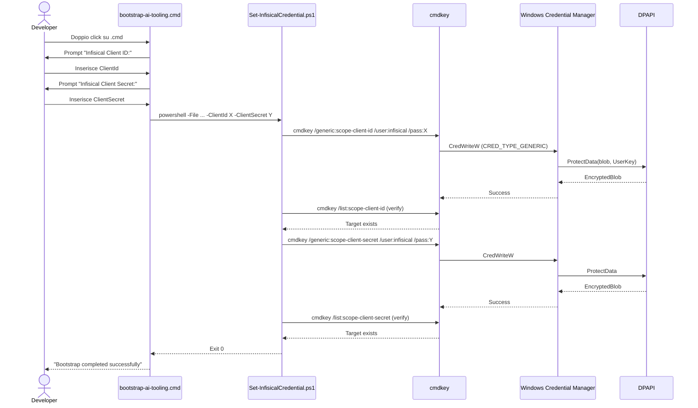
```mermaid
sequenceDiagram
    actor Dev as Developer
    participant CMD as bootstrap-ai-tooling.cmd
    participant PS as Set-InfisicalCredential.ps1
    participant CK as cmdkey
    participant WCM as Windows Credential Manager
    participant DPAPI

    Dev->>CMD: Doppio click su .cmd
    CMD->>Dev: Prompt "Infisical Client ID:"
    Dev->>CMD: Inserisce ClientId
    CMD->>Dev: Prompt "Infisical Client Secret:"
    Dev->>CMD: Inserisce ClientSecret
    CMD->>PS: powershell -File ... -ClientId X -ClientSecret Y
    PS->>CK: cmdkey /generic:scope-client-id /user:infisical /pass:X
    CK->>WCM: CredWriteW (CRED_TYPE_GENERIC)
    WCM->>DPAPI: ProtectData(blob, UserKey)
    DPAPI-->>WCM: EncryptedBlob
    WCM-->>CK: Success
    PS->>CK: cmdkey /list:scope-client-id (verify)
    CK-->>PS: Target exists
    PS->>CK: cmdkey /generic:scope-client-secret /user:infisical /pass:Y
    CK->>WCM: CredWriteW
    WCM->>DPAPI: ProtectData
    DPAPI-->>WCM: EncryptedBlob
    WCM-->>CK: Success
    PS->>CK: cmdkey /list:scope-client-secret (verify)
    CK-->>PS: Target exists
    PS-->>CMD: Exit 0
    CMD-->>Dev: "Bootstrap completed successfully"
```

### 14.4 Verifica post-bootstrap

```powershell
# Lista delle credenziali create
cmdkey /list:gargiolastech-ai-tooling-dev-client-id
cmdkey /list:gargiolastech-ai-tooling-dev-client-secret
```

Output atteso:

```
Currently stored credentials:
    Target: gargiolastech-ai-tooling-dev-client-id
    Type: Generic
    User: infisical
```

**`cmdkey /list` non rivela il blob cifrato**: mostra solo metadati. Per leggere il valore serve il P/Invoke `CredRead`, eseguibile solo dall'utente proprietario delle credenziali.

### 14.5 Cancellazione/rotazione

```powershell
cmdkey /delete:gargiolastech-ai-tooling-dev-client-id
cmdkey /delete:gargiolastech-ai-tooling-dev-client-secret
```

E poi re-bootstrap con i nuovi valori. (Vedi Sezione 28 per la procedura completa di rotazione.)

---

## 15. Runtime launcher flow

### 15.1 Dispatcher `Start-AiIde.ps1`

Lo script `Start-AiIde.ps1` è il **dispatcher** che gestisce la selezione multi-progetto e la **risoluzione dell'IDE associato**. La sua responsabilità è:

1. Caricare e validare `projects.json` (incluso il dizionario `ides`).
2. Presentare all'utente la lista dei progetti (oppure restituirla con `-List`).
3. Accettare l'input dell'utente (interattivo o via parametro `-ProjectKey`).
4. **Risolvere l'IDE** del progetto selezionato: prendere il campo `selected.ide` (es. `"rider"`, `"visualstudio"`) e fare lookup in `config.ides` per ottenere il path dell'eseguibile.
5. Validare l'esistenza del path dell'IDE e delegare l'esecuzione effettiva a `Start-Ide-With-AiSecrets.ps1` passando `-IdeType` e `-IdePath`.

### 15.2 Anatomia del dispatcher

```powershell
param(
    [string] $ConfigPath = "$env:USERPROFILE\.gargiolastech\ai-tooling\projects.json",
    [switch] $List,
    [string] $ProjectKey
)
```

**Decisione di design importante**: il path della configurazione è **fuori dal repo** per default. Questo è coerente con il principio "il repo è inerte".

Funzioni chiave:

| Funzione | Responsabilità |
|---|---|
| `Resolve-RepositoryPath` | Calcola path assoluti relativi a `$PSScriptRoot` (cartella dello script) |
| `Resolve-ScriptPath` | Verifica esistenza di uno script peer (`Start-Ide-With-AiSecrets.ps1`) |
| `New-DefaultConfig` | Crea `projects.json` dal template al primo avvio |
| `Read-LauncherConfig` | Parse JSON con `ConvertFrom-Json` ed encoding UTF-8 esplicito |
| `Validate-LauncherConfig` | Controlla campi obbligatori, path esistenti, no placeholder residui |
| `Show-Projects` | Stampa lista numerata dei progetti |
| `Select-Project` | Accetta input numerico interattivo o key esplicita |

### 15.3 Validazione difensiva

La funzione `Validate-LauncherConfig` esegue una serie di controlli **fail-fast** a livello configurazione globale e per ogni progetto:

```powershell
if ([string]::IsNullOrWhiteSpace($Config.credentialScope)) {
    throw "Configurazione non valida: credentialScope è obbligatorio."
}

if ([string]::IsNullOrWhiteSpace($Config.environment)) {
    throw "Configurazione non valida: environment è obbligatorio."
}

if ([string]::IsNullOrWhiteSpace($Config.infisicalHost)) {
    throw "Configurazione non valida: infisicalHost è obbligatorio."
}

if ($null -eq $Config.ides) {
    throw "Configurazione non valida: ides è obbligatorio."
}

foreach ($project in $Config.projects) {
    if ([string]::IsNullOrWhiteSpace($project.key)) {
        throw "Configurazione non valida: ogni progetto deve avere key."
    }
    # ... altri controlli (name, solutionPath)
    if ($project.infisicalProjectId -eq "REPLACE_WITH_INFISICAL_PROJECT_ID") {
        throw "Configurazione non valida: ... non ha infisicalProjectId valorizzato."
    }
    if (-not (Test-Path $project.solutionPath)) {
        throw "solutionPath non trovato per '$($project.key)': $($project.solutionPath)"
    }
}
```

Dopo la selezione del progetto, viene eseguita la **risoluzione e validazione dell'IDE**:

```powershell
$ideKey = $selected.ide

if ([string]::IsNullOrWhiteSpace($ideKey)) {
    throw "Il progetto '$($selected.key)' non ha il campo ide valorizzato."
}

$ideConfig = $Config.ides.$ideKey

if ($null -eq $ideConfig) {
    throw "IDE '$ideKey' non configurato nella sezione ides."
}

$idePath = $ideConfig.path

if ([string]::IsNullOrWhiteSpace($idePath)) {
    throw "Path non configurato per IDE '$ideKey'."
}

if (-not (Test-Path $idePath)) {
    throw "IDE '$ideKey' non trovato nel percorso: $idePath"
}
```

**Filosofia**: meglio fallire prima di chiamare Infisical che dopo. Diagnosi più chiara, zero rumore in audit log Infisical per chiamate destinate al fallimento.

### 15.4 Modalità di invocazione del dispatcher

| Comando | Comportamento |
|---|---|
| `.\Start-AiIde.cmd` | Mostra lista, chiede input numerico interattivo |
| `.\Start-AiIde.ps1 -List` | Stampa solo la lista, esce (utile per scripting) |
| `.\Start-AiIde.ps1 -ProjectKey quoteflow` | Avvia direttamente il progetto con `key = quoteflow` |
| `.\Start-AiIde.ps1 -ConfigPath C:\altra\config.json` | Usa una configurazione alternativa |

### 15.5 Passaggio di controllo all'engine

```powershell
$enginePath = Resolve-ScriptPath -FileName "Start-Ide-With-AiSecrets.ps1"

& powershell `
    -ExecutionPolicy Bypass `
    -NoProfile `
    -File $enginePath `
    -ProjectId $selected.infisicalProjectId `
    -Environment $config.environment `
    -CredentialScope $config.credentialScope `
    -InfisicalHost $config.infisicalHost `
    -IdeType $ideKey `
    -IdePath $idePath `
    -SolutionPath $selected.solutionPath
```

**Differenza chiave rispetto alla v1.0**: i parametri `-RiderPath` sono stati sostituiti dalla coppia `-IdeType` (identificatore logico, es. `"rider"` o `"visualstudio"`) e `-IdePath` (path eseguibile risolto). L'engine non conosce il dettaglio di quale IDE sta avviando: si limita a invocare `Start-Process` sul path che riceve.

**Razionale del sub-process**: invocare l'engine in un **processo PowerShell figlio** consente di:

- isolare lo stato (variabili globali, `$env:` modificati durante l'engine non persistono nel dispatcher);
- catturare `$LASTEXITCODE` in modo deterministico;
- avere stack trace di errore puliti se l'engine fallisce.

---

## 16. Multi-project launcher

### 16.1 Motivazione

Un developer senior di solito lavora su **più solution**: progetti enterprise, side project, librerie interne. Soluzioni alternative considerate:

| Approccio | Problema |
|---|---|
| Uno script per progetto (`Start-AiIde-QuoteFlow.ps1`, `Start-AiIde-WCM.ps1`, …) | Esplosione del numero di script, drift della logica core, manutenzione duplicata |
| Hardcode dei progetti dentro l'engine | Modifica del codice ad ogni nuovo progetto, no separazione configurazione/codice |
| Variabili d'ambiente per progetto attivo | Stato implicito globale, difficile cambiare progetto rapidamente |
| **Configurazione dichiarativa + dispatcher numerico** ✅ | Single script, multi-tenant via JSON, side-effect-free |

### 16.2 Schema decisionale

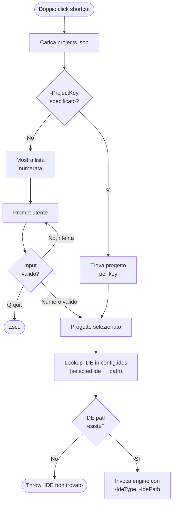
```mermaid
flowchart TB
    Start([Doppio click shortcut]) --> Load["Carica projects.json"]
    Load --> Check{"-ProjectKey<br/>specificato?"}
    Check -->|Sì| FindByKey["Trova progetto<br/>per key"]
    Check -->|No| ShowList["Mostra lista<br/>numerata"]
    ShowList --> Prompt["Prompt utente"]
    Prompt --> Input{"Input<br/>valido?"}
    Input -->|No, ritenta| Prompt
    Input -->|Q quit| Exit([Esce])
    Input -->|Numero valido| Selected["Progetto selezionato"]
    FindByKey --> Selected
    Selected --> ResolveIde["Lookup IDE in config.ides<br/>(selected.ide → path)"]
    ResolveIde --> ValidateIde{"IDE path<br/>esiste?"}
    ValidateIde -->|No| FailIde([Throw: IDE non trovato])
    ValidateIde -->|Sì| Engine["Invoca engine con<br/>-IdeType, -IdePath"]
```

### 16.3 Esempio output utente

```
============================================================
 Progetti disponibili
============================================================
[1] GargiolasTech DevEx WCM (wcm)
    Path: C:\dev\gargiolastech-devex-wcm
[2] QuoteFlow (quoteflow)
    Path: C:\dev\quoteflow

Seleziona il numero del progetto da avviare oppure Q per uscire: 2

============================================================
 Avvio progetto
============================================================
Progetto: QuoteFlow
Key:      quoteflow
IDE:      rider
IDE Path: C:\Program Files\JetBrains\JetBrains Rider 2025.1\bin\rider64.exe
Path:     C:\dev\quoteflow

============================================================
 AI IDE Bootstrap
============================================================
[... output engine ...]
```

### 16.4 Scenari multi-progetto avanzati

#### Scenario A: Progetti su IDE differenti

Il caso d'uso più comune del multi-IDE: alcuni progetti girano su Rider (preferito per .NET moderno) mentre altri richiedono Visual Studio 2022 (es. progetti WPF legacy, integrazione con designer C++/CLI, progetti SQL Server Data Tools). Soluzione nativa: dichiarare entrambi gli IDE nella sezione `ides` di `projects.json` e impostare il campo `ide` di ogni progetto.

```json
{
  "ides": {
    "rider": { "path": "C:\\Program Files\\JetBrains\\JetBrains Rider 2025.1\\bin\\rider64.exe" },
    "visualstudio": { "path": "C:\\Program Files\\Microsoft Visual Studio\\2022\\Community\\Common7\\IDE\\devenv.exe" }
  },
  "projects": [
    { "key": "modern-api", "ide": "rider", ... },
    { "key": "legacy-wpf", "ide": "visualstudio", ... }
  ]
}
```

#### Scenario B: Progetti con Machine Identity differenti

In casi enterprise, alcuni progetti possono richiedere Machine Identity con permessi diversi (es. un progetto "high-trust" che accede a segreti sensibili). Soluzione: usare `credentialScope` diversi per progetto.

Sebbene `projects.json` come implementato attualmente abbia un singolo `credentialScope` a livello root, l'architettura è estendibile a override per-progetto (vedi Sezione 29).

#### Scenario C: Stessa Machine Identity, environment diversi

Comune: stessa identità tecnica, ma il progetto `quoteflow` usa env `dev` e `wcm` usa env `staging`. Anche questo è un punto di estensione: l'engine accetta già `-Environment` come parametro indipendente.

---

## 17. File di configurazione

### 17.1 Inventario dei file di configurazione

| File | Posizione | Scope | Versionato |
|---|---|---|:---:|
| `projects.json.template` | `<repo>/templates/` | Schema di riferimento | ✅ |
| `projects.json` | `~/.gargiolastech/ai-tooling/` | Configurazione utente effettiva | ❌ |
| `continue.env` | `~/.gargiolastech/ai-tooling/runtime/` | Segreti runtime Continue | ❌ |
| `aider.env` | `~/.gargiolastech/ai-tooling/runtime/` | Segreti runtime Aider | ❌ |
| Continue config (`config.json`) | `~/.continue/config.json` | Configurazione Continue (non sensibile) | ❌ (Continue gestisce in proprio) |
| Aider config (`.aider.conf.yml`) | Per-progetto o utente | Configurazione Aider | ❌ |

### 17.2 Encoding e formati

| Formato | Encoding | Strumento di lettura |
|---|---|---|
| `projects.json` | UTF-8 (no BOM) | PowerShell `ConvertFrom-Json` |
| `*.env` runtime | UTF-8 (no BOM) | Continue/Aider parser |
| Script PS1 | UTF-8 con BOM (raccomandato per Windows PowerShell 5.1) | Windows PowerShell |
| Script CMD | ANSI/CP1252 (per evitare interpretazione errata in cmd.exe) | cmd.exe |

### 17.3 Convenzione path utente

Tutti gli artefatti runtime e di configurazione utente vivono sotto:

```
%USERPROFILE%\.gargiolastech\ai-tooling\
```

**Rationale dell'underscore-prefix**: il punto iniziale (`.gargiolastech`) segue la convenzione Unix-style dei "dotfiles": cartelle di tooling che non disturbano la navigazione di file utente. Sebbene Windows non nasconda i dotfile per default, l'esplicita separazione tooling/dati utente migliora la pulizia.

---

## 18. `projects.json` — spiegazione completa

### 18.1 Schema JSON

```json
{
  "credentialScope": "string (required)",
  "environment": "string (required)",
  "infisicalHost": "string (required, URL)",
  "ides": {
    "<ide-key>": {
      "path": "string (required, absolute path to IDE executable)"
    }
  },
  "projects": [
    {
      "key": "string (required, unique within array)",
      "name": "string (required, display name)",
      "ide": "string (required, must match a key in ides)",
      "solutionPath": "string (required, absolute path to .sln directory)",
      "infisicalProjectId": "string (required, NOT placeholder)"
    }
  ]
}
```

### 18.2 Differenze rispetto alla v1.0

| Aspetto | v1.0 | v2.0 (corrente) |
|---|---|---|
| Path IDE | `riderPath` (root, singolo) | `ides` dictionary con N entry |
| Selezione IDE per progetto | Implicita (sempre Rider) | Esplicita via campo `ide` del progetto |
| Aggiungere un nuovo IDE | Modifica di codice nello script engine | Aggiungere entry in `ides`, nessuna modifica di codice |
| Naming convention IDE | — | Convenzione: snake_case (`rider`, `visualstudio`, `vscode`, `cursor`) |

### 18.3 Documentazione campo per campo

#### `credentialScope` (string, root)

- **Significato**: prefisso utilizzato per costruire i target name in Windows Credential Manager.
- **Default convenzionale**: `gargiolastech-ai-tooling-dev`.
- **Costruzione target**: lo script appende `-client-id` e `-client-secret` allo scope.
  Esempi:
  ```
  scope                                       = "gargiolastech-ai-tooling-dev"
  → WCM target client id                      = "gargiolastech-ai-tooling-dev-client-id"
  → WCM target client secret                  = "gargiolastech-ai-tooling-dev-client-secret"
  ```
- **Quando cambiarlo**: per separare Machine Identity per ambiente (`...-staging`, `...-prod`), per workstation condivisa con altri profili.

#### `environment` (string, root)

- **Significato**: environment Infisical (`dev`, `staging`, `prod`).
- **Default**: `dev`.
- **Propagazione**: passato a `infisical export --env <value>`.

#### `infisicalHost` (string, root)

- **Significato**: base URL dell'istanza Infisical.
- **Default**: `https://app.infisical.com` (SaaS).
- **Self-hosted**: usare URL custom, es. `https://infisical.company.internal`.
- **Propagazione**: setta `$env:INFISICAL_API_URL` prima del login CLI.

#### `ides` (object, root) — NUOVO IN v2.0

- **Significato**: dizionario di IDE disponibili sulla workstation. Ogni entry è identificata da una chiave logica (es. `"rider"`, `"visualstudio"`) e contiene il path assoluto all'eseguibile.
- **Struttura**:
  ```json
  "ides": {
    "<ide-key>": {
      "path": "C:\\absolute\\path\\to\\ide.exe"
    }
  }
  ```
- **Validazione**: il campo `ides` deve essere presente (anche se con una sola entry). Il path effettivo viene validato solo per l'IDE referenziato dal progetto selezionato (lazy validation), non per tutti gli IDE configurati.
- **Convenzioni di key**:
  | Key consigliata | IDE |
  |---|---|
  | `rider` | JetBrains Rider |
  | `visualstudio` | Visual Studio 2022 (`devenv.exe`) |
  | `vscode` | Visual Studio Code (futuro) |
  | `cursor` | Cursor IDE (futuro) |
  | `idea` | IntelliJ IDEA (per progetti Java/Kotlin in team misti) |

#### `projects[].key` (string)

- **Significato**: identificatore univoco del progetto per selezione non interattiva (`-ProjectKey`).
- **Convenzione**: snake_case o kebab-case breve (`quoteflow`, `wcm`, `payment-gateway`).
- **Vincoli**: unico nell'array `projects`. La validazione fallisce se key duplicate.

#### `projects[].name` (string)

- **Significato**: nome human-friendly mostrato nella lista interattiva.
- **Esempio**: `"GargiolasTech DevEx WCM"`, `"QuoteFlow Enterprise"`.

#### `projects[].ide` (string) — NUOVO IN v2.0

- **Significato**: chiave dell'IDE da utilizzare per questo progetto. Deve corrispondere esattamente a una chiave presente in `ides`.
- **Validazione fail-fast**:
  - Se vuoto/assente → `"Il progetto '<key>' non ha il campo ide valorizzato."`
  - Se non presente in `ides` → `"IDE '<ide>' non configurato nella sezione ides."`
  - Se il path dell'IDE non esiste su disco → `"IDE '<ide>' non trovato nel percorso: <path>"`
- **Esempio**: `"ide": "rider"` o `"ide": "visualstudio"`.

#### `projects[].solutionPath` (string)

- **Significato**: path assoluto alla directory che contiene il file `.sln` (o più `.sln` per soluzioni multi-progetto).
- **Comportamento**:
  - Se la directory contiene **un solo `.sln`**, l'engine apre direttamente quel file passandolo come argomento all'IDE.
  - Se contiene **più `.sln`**, apre l'IDE sulla directory e l'utente seleziona la solution dall'IDE.
- **Compatibilità multi-IDE**: il pattern di passaggio argomento (`<ide.exe> "<path>"`) è supportato sia da `rider64.exe` che da `devenv.exe` (Visual Studio). Per IDE che richiedono sintassi diversa serve un wrapper (vedi Sezione 29).
- **Validazione**: lo script verifica esistenza tramite `Test-Path`.

#### `projects[].infisicalProjectId` (string)

- **Significato**: ID univoco del progetto Infisical (formato UUID-like fornito da Infisical).
- **Vincolo critico**: il valore `REPLACE_WITH_INFISICAL_PROJECT_ID` (default del template) causa fail-fast in validazione, prevenendo configurazioni incomplete.

### 18.4 Esempio completo di `projects.json` configurato

```json
{
  "credentialScope": "gargiolastech-ai-tooling-dev",
  "environment": "dev",
  "infisicalHost": "https://app.infisical.com",
  "ides": {
    "rider": {
      "path": "C:\\Program Files\\JetBrains\\JetBrains Rider 2025.1\\bin\\rider64.exe"
    },
    "visualstudio": {
      "path": "C:\\Program Files\\Microsoft Visual Studio\\2022\\Community\\Common7\\IDE\\devenv.exe"
    }
  },
  "projects": [
    {
      "key": "wcm",
      "name": "GargiolasTech DevEx WCM",
      "ide": "rider",
      "solutionPath": "C:\\dev\\gargiolastech-devex-wcm",
      "infisicalProjectId": "abcd1234-ef56-7890-1234-567890abcdef"
    },
    {
      "key": "quoteflow",
      "name": "QuoteFlow",
      "ide": "rider",
      "solutionPath": "C:\\dev\\quoteflow",
      "infisicalProjectId": "fedc4321-ba98-7654-3210-fedcba987654"
    },
    {
      "key": "legacy-wpf",
      "name": "Legacy WPF App",
      "ide": "visualstudio",
      "solutionPath": "C:\\dev\\legacy-wpf",
      "infisicalProjectId": "11223344-5566-7788-99aa-bbccddeeff00"
    }
  ]
}
```

### 18.5 Validazione lato CI (futuro)

Per ambienti enterprise dove `projects.json` venga distribuito tramite tool di configuration management (Ansible, Chef), è raccomandato uno **schema JSON formale** validabile via `Test-Json` di PowerShell o tool esterni:

```json
{
  "$schema": "http://json-schema.org/draft-07/schema#",
  "type": "object",
  "required": ["credentialScope", "environment", "infisicalHost", "ides", "projects"],
  "properties": {
    "credentialScope": { "type": "string", "minLength": 1 },
    "environment": { "type": "string", "enum": ["dev", "staging", "prod"] },
    "infisicalHost": { "type": "string", "format": "uri" },
    "ides": {
      "type": "object",
      "minProperties": 1,
      "additionalProperties": {
        "type": "object",
        "required": ["path"],
        "properties": {
          "path": { "type": "string", "minLength": 1 }
        }
      }
    },
    "projects": {
      "type": "array",
      "minItems": 1,
      "items": {
        "type": "object",
        "required": ["key", "name", "ide", "solutionPath", "infisicalProjectId"],
        "properties": {
          "key": { "type": "string", "pattern": "^[a-z0-9-]+$" },
          "name": { "type": "string", "minLength": 1 },
          "ide": { "type": "string", "minLength": 1 },
          "solutionPath": { "type": "string", "minLength": 1 },
          "infisicalProjectId": {
            "type": "string",
            "not": { "const": "REPLACE_WITH_INFISICAL_PROJECT_ID" }
          }
        }
      }
    }
  }
}
```

Una validazione runtime aggiuntiva — non esprimibile in JSON Schema standard — è che ogni `projects[].ide` esista come chiave in `ides`. Questo controllo viene eseguito dallo script PowerShell post-deserializzazione (vedi Sezione 15.3).

---

## 19. Integrazione Continue

### 19.1 Cos'è Continue

[Continue.dev](https://continue.dev) è un'estensione AI-coding open source per JetBrains IDE e VS Code. Offre:

- chat AI in-IDE;
- autocompletion intelligente;
- refactoring assistito;
- supporto multi-modello (OpenAI, Anthropic, Mistral, modelli locali via Ollama/LiteLLM).

### 19.2 Modalità di consumo delle variabili d'ambiente

Continue legge variabili d'ambiente attraverso **due meccanismi**:

1. **Direttamente dall'ambiente di processo**: variabili `$env:OPENAI_API_KEY` ereditate dal processo padre (l'IDE — Rider, Visual Studio con estensione Continue, …).
2. **Da un file `.env` puntato da `CONTINUE_ENV_FILE`**: meccanismo che adottiamo.

Lo script engine imposta:

```powershell
$env:CONTINUE_ENV_FILE = $continueEnvPath
```

Prima di avviare l'IDE, in modo che Continue (caricato come plugin dell'IDE — Rider, Visual Studio o altro) erediti la variabile e legga il file.

### 19.3 Esempio di `continue.env` generato

Il file `continue.env` è il risultato della **concatenazione** dei segreti dei path Infisical `/global` e `/continue`:

```bash
# Path: /global
ANTHROPIC_API_KEY="sk-ant-api03-..."
OPENAI_API_KEY="sk-proj-..."
LITELLM_BASE_URL="https://litellm.company.internal"

# Path: /continue
CONTINUE_DEFAULT_MODEL="claude-sonnet-4-20250514"
CONTINUE_TELEMETRY_ENABLED="false"
```

I commenti `# Path: <path>` sono **aggiunti dallo script per tracciabilità** durante il debug. Non hanno effetti runtime ma facilitano l'identificazione della sorgente dei singoli segreti.

### 19.4 Configurazione `config.json` di Continue

La configurazione di Continue (non sensibile) può essere mantenuta nel repository, ad esempio in una cartella `continue/config.json` (non presente nel repo base ma punto di estensione naturale):

```json
{
  "models": [
    {
      "title": "Claude Sonnet (Anthropic)",
      "provider": "anthropic",
      "model": "claude-sonnet-4-20250514",
      "apiKey": "${ANTHROPIC_API_KEY}"
    },
    {
      "title": "GPT-4 (OpenAI)",
      "provider": "openai",
      "model": "gpt-4o",
      "apiKey": "${OPENAI_API_KEY}"
    }
  ]
}
```

L'**interpolazione `${VAR}`** è una feature di Continue che risolve a runtime le variabili d'ambiente lette da `CONTINUE_ENV_FILE`.

### 19.5 Flusso di iniezione

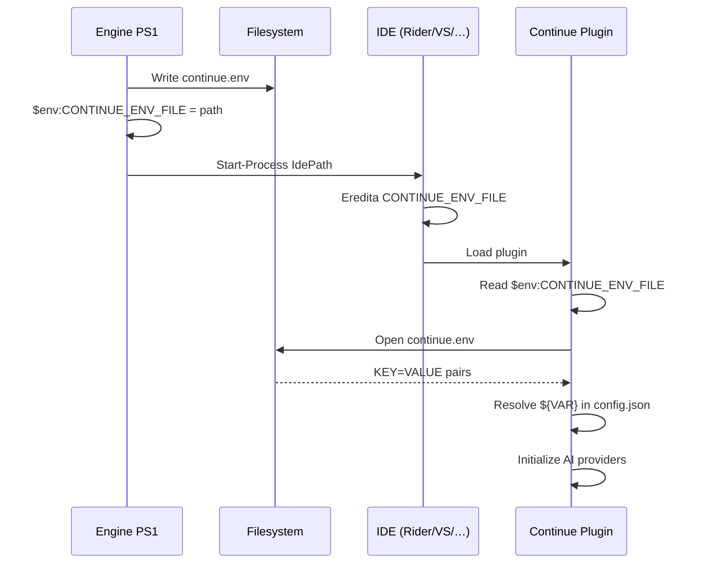
```mermaid
sequenceDiagram
    participant Engine as Engine PS1
    participant FS as Filesystem
    participant IDE as IDE (Rider/VS/…)
    participant Continue as Continue Plugin

    Engine->>FS: Write continue.env
    Engine->>Engine: $env:CONTINUE_ENV_FILE = path
    Engine->>IDE: Start-Process IdePath
    IDE->>IDE: Eredita CONTINUE_ENV_FILE
    IDE->>Continue: Load plugin
    Continue->>Continue: Read $env:CONTINUE_ENV_FILE
    Continue->>FS: Open continue.env
    FS-->>Continue: KEY=VALUE pairs
    Continue->>Continue: Resolve ${VAR} in config.json
    Continue->>Continue: Initialize AI providers
```

---

## 20. Integrazione Aider

### 20.1 Cos'è Aider

[Aider](https://aider.chat) è un AI pair-programmer da terminale, scritto in Python. Si integra direttamente con la repo Git, applica modifiche al codice e crea commit. Supporta OpenAI, Anthropic, e modelli via LiteLLM.

### 20.2 Configurazione via variabili d'ambiente

Aider legge **per convenzione** decine di variabili d'ambiente:

- `OPENAI_API_KEY`
- `ANTHROPIC_API_KEY`
- `AIDER_MODEL`
- `AIDER_WEAK_MODEL`
- `AIDER_EDIT_FORMAT`
- ... e molte altre

L'approccio adottato è **identico a Continue**: lo script engine genera `aider.env` e setta `AIDER_ENV_FILE`:

```powershell
$env:AIDER_ENV_FILE = $aiderEnvPath
```

### 20.3 Caricamento da terminale integrato

L'integrazione tipica con Aider è aprire un **terminale integrato dell'IDE** e lanciare:

```bash
aider --env-file %AIDER_ENV_FILE% src/MyProject.cs
```

| IDE | Come aprire il terminale integrato |
|---|---|
| JetBrains Rider | `View → Tool Windows → Terminal` (Alt+F12) |
| Visual Studio 2022 | `View → Terminal` (Ctrl+\`) |
| Visual Studio Code | `View → Terminal` (Ctrl+\`) |

In alternativa, configurare un alias persistente o uno script wrapper che legga automaticamente `AIDER_ENV_FILE`.

### 20.4 Esempio di `aider.env` generato

```bash
# Path: /global
OPENAI_API_KEY="sk-proj-..."
ANTHROPIC_API_KEY="sk-ant-..."

# Path: /aider
AIDER_MODEL="gpt-4o"
AIDER_WEAK_MODEL="gpt-4o-mini"
AIDER_AUTO_COMMITS="true"
AIDER_GIT_COMMIT_VERIFY="true"
```

### 20.5 Considerazione di sicurezza: rotazione segreti durante sessione Aider lunga

Aider tipicamente avvia una connessione al provider AI e mantiene la sessione aperta. Se i segreti vengono ruotati durante una sessione di lavoro:

- Continue (in-IDE) può rifiutare nuove richieste finché il file `.env` non viene rigenerato (richiede riavvio Rider).
- Aider continua a usare la chiave caricata all'avvio, finché la sessione non scade lato provider.

**Mitigazione**: dopo una rotazione di emergenza, chiudere e riaprire l'IDE per propagare le nuove chiavi (perché il file `.env` viene rigenerato all'avvio del launcher).

### 20.6 Installer Aider: razionale architetturale

Aider è un pacchetto Python (`aider-chat` su PyPI). L'installazione "ingenua" sarebbe `pip install aider-chat` nel Python di sistema, ma in contesti enterprise questo approccio presenta diverse problematiche.

#### Problemi dell'installazione globale

| Problema | Conseguenza |
|---|---|
| Pollution del global site-packages | Aider trascina ~80 dipendenze (tiktoken, litellm, openai, anthropic, tree-sitter, …) che possono entrare in conflitto con altri tool Python installati sulla stessa macchina |
| Mancanza di isolamento di versione | Un upgrade aggressivo (`pip install --upgrade aider-chat`) può fare downgrade transitivo di librerie usate da altri progetti |
| Permessi | Su Windows, l'installazione globale può richiedere admin se Python è in `Program Files`; il virtualenv vive sempre nel profilo utente |
| Riproducibilità | Setup non riproducibili tra workstation se il Python di sistema diverge per minor version |
| Cleanup | Disinstallare Aider richiede `pip uninstall` di decine di dipendenze; con un venv basta cancellare la cartella |

#### Soluzione adottata

L'installer adotta un **virtualenv dedicato** in `~/.venvs/aider-env`, ottenendo:

1. **Isolamento totale**: nessun impatto sul Python di sistema o su altri venv.
2. **Idempotenza**: ri-eseguire l'installer non rompe nulla; un eventuale upgrade è gestito da `pip install --upgrade`.
3. **Disinstallabilità**: `Remove-Item -Recurse $VenvPath` rimuove tutto.
4. **Eseguibile diretto**: lo script invoca `$VenvPath\Scripts\aider.exe` senza dover attivare il venv tramite script di activation. Robusto per uso non-interattivo.

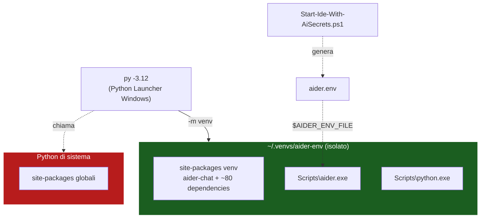
```mermaid
flowchart TB
    subgraph PySys["Python di sistema"]
        SitePkg["site-packages globali"]
    end

    subgraph PyVenv["~/.venvs/aider-env (isolato)"]
        VenvPkg["site-packages venv<br/>aider-chat + ~80 dependencies"]
        VenvExe["Scripts\aider.exe"]
        VenvPy["Scripts\python.exe"]
    end

    PythonLauncher["py -3.12<br/>(Python Launcher Windows)"]
    PythonLauncher -->|"-m venv"| PyVenv
    PythonLauncher -.->|"chiama"| PySys
    Engine["Start-Ide-With-AiSecrets.ps1"] -.->|"genera"| EnvFile["aider.env"]
    EnvFile -.->|"$AIDER_ENV_FILE"| VenvExe

    style PySys fill:#b71c1c,stroke:#fff,color:#fff
    style PyVenv fill:#1b5e20,stroke:#fff,color:#fff
```

### 20.7 Anatomia di `Install-Aider.ps1`

```powershell
param(
    [string] $PythonVersion = "3.12",
    [string] $VenvPath = "$HOME\.venvs\aider-env",
    [switch] $ForceRecreate
)
```

#### Pipeline di esecuzione

| # | Step | Comando chiave | Failure mode |
|---|---|---|---|
| 1 | Verifica Python Launcher | `Get-Command py` | Throw se assente |
| 2 | Verifica versione Python | `py -<version> --version` | Throw se la versione richiesta non è installata |
| 3 | (Opzionale) Rimozione venv esistente | `Remove-Item -Recurse $VenvPath` (solo se `-ForceRecreate`) | — |
| 4 | Creazione directory parent | `New-Item -ItemType Directory $venvParent` | — |
| 5 | Creazione virtualenv | `py -<version> -m venv $VenvPath` | Throw se il path non è scrivibile |
| 6 | Upgrade pip tooling | `python.exe -m pip install --upgrade pip setuptools wheel` | Throw su exit code ≠ 0 |
| 7 | Installazione/upgrade Aider | `python.exe -m pip install --upgrade aider-chat` | Throw su exit code ≠ 0 |
| 8 | Verifica eseguibile | `Test-Path $AiderExe` | Throw se assente |
| 9 | Smoke test | `$AiderExe --version` | Throw su exit code ≠ 0 |

#### Decisioni di design notevoli

**Perché `py -<version>` invece di `python.exe` diretto?**

Il [Python Launcher per Windows](https://docs.python.org/3/using/windows.html#launcher) è installato con qualsiasi installazione recente di Python da python.org. Espone una sintassi unica per selezionare una specifica versione di Python tra quelle installate:

```powershell
py -3.12 --version    # Forza Python 3.12 anche se 3.13 è il default
py -3.13 --version    # Forza Python 3.13
```

Questo è cruciale in workstation enterprise dove convivono **più versioni di Python** (es. 3.11 per progetti legacy, 3.12 per nuovi progetti). Chiamare `python.exe` direttamente risolverebbe alla versione nel `PATH`, che è imprevedibile.

**Perché upgrade esplicito di `pip setuptools wheel`?**

L'installer di venv crea il virtualenv con la versione di pip bundled con Python. Su installazioni Python più vecchie di qualche mese, pip può essere obsoleto. L'upgrade preventivo evita warning durante l'installazione e abilita feature recenti (es. resolver migliorato di pip 23+).

**Perché lo script non setta `PATH`?**

Il PATH globale è una risorsa scarsa e contesa. Aggiungere `$VenvPath\Scripts` al `PATH` avrebbe effetti collaterali:

- pollution per altri tool che chiamano `python.exe`;
- conflitti se l'utente ha già un Python diverso nel PATH;
- richiesta di restart della shell.

La soluzione è chiamare `aider.exe` con path assoluto sempre, sia nelle istruzioni utente sia nel launcher.

### 20.8 Uso quotidiano post-installazione

#### Invocazione manuale di Aider

Dal terminale integrato dell'IDE o da una qualsiasi PowerShell:

```powershell
& "$HOME\.venvs\aider-env\Scripts\aider.exe" `
    --env-file $env:AIDER_ENV_FILE `
    src\MyProject.cs
```

#### Alias persistente in `$PROFILE`

Per rendere l'invocazione più ergonomica, definire un alias in `$PROFILE`:

```powershell
function aider {
    & "$HOME\.venvs\aider-env\Scripts\aider.exe" --env-file $env:AIDER_ENV_FILE @args
}
```

In questo modo `aider src/MyProject.cs` invoca automaticamente l'eseguibile corretto con il file di environment runtime.

#### Aggiornamento di Aider

Ri-eseguire `Install-Aider.cmd` esegue idempotentemente `pip install --upgrade aider-chat`. Non occorre `-ForceRecreate` salvo in caso di problemi:

```powershell
.\Install-Aider.cmd
```

#### Ricreazione completa del virtualenv

Caso d'uso: upgrade del Python da 3.12 a 3.13. Il virtualenv è legato al Python con cui è stato creato e va ricostruito:

```powershell
.\Install-Aider.ps1 -PythonVersion 3.13 -ForceRecreate
```

#### Disinstallazione

```powershell
Remove-Item -Recurse -Force "$HOME\.venvs\aider-env"
```

Nessun residuo nel registry, nessun PATH cleanup necessario.

---

## 21. Integrazione IDE (Rider, Visual Studio, …)

### 21.1 Modello IDE-agnostic

A partire dalla v2.0, l'engine non conosce alcun IDE specifico. Riceve come parametri:

- `-IdeType` (es. `"rider"`, `"visualstudio"`) — utilizzato esclusivamente per logging/output diagnostico;
- `-IdePath` — path assoluto dell'eseguibile da invocare via `Start-Process`.

Tutta la logica IDE-specifica vive **fuori dall'engine**: nel file `projects.json` (dichiarativo) e nel dispatcher `Start-AiIde.ps1` (risoluzione `selected.ide` → `config.ides[<key>].path`).

### 21.2 Modalità di avvio

Lo script engine determina dinamicamente cosa passare all'IDE come argomento:

```powershell
$solutionFiles = @(
    Get-ChildItem -Path $SolutionPath -Filter "*.sln" -File
)

if ($solutionFiles.Count -eq 0) {
    throw "Nessun file .sln trovato in: $SolutionPath"
}

if ($solutionFiles.Count -eq 1) {
    $targetPath = $solutionFiles[0].FullName
}
else {
    $targetPath = $SolutionPath
}

Start-Process -FilePath $IdePath -ArgumentList "`"$targetPath`""
```

### 21.3 Comportamento

| Numero di `.sln` in `solutionPath` | Comportamento |
|---|---|
| 0 | **Fail-fast**: throw "Nessun file .sln trovato" |
| 1 | Apertura **diretta** del singolo `.sln` |
| 2+ | Apertura della **directory**: l'IDE mostra dialog di selezione solution (sia Rider che Visual Studio supportano l'apertura di una directory) |

### 21.4 Compatibilità del passaggio argomento

Lo schema `<ide.exe> "<path>"` è supportato da:

| IDE | Eseguibile | Comportamento con `.sln` | Comportamento con directory |
|---|---|---|---|
| JetBrains Rider | `rider64.exe` | Apre la solution | Apre la directory come solution browsable |
| Visual Studio 2022 | `devenv.exe` | Apre la solution | Apre la directory ("Open Folder" mode) |
| Visual Studio Code | `code.cmd` | Apre la solution come file | Apre la directory come workspace |
| Cursor | `Cursor.exe` | Apre la solution come file | Apre la directory come workspace |

Per IDE con sintassi argomenti diversa (es. quelli che richiedono `--open-folder` o flag specifici), l'engine attuale richiederebbe estensione (vedi Sezione 29).

### 21.5 Ereditarietà environment

Quando `Start-Process` avvia l'IDE, il processo figlio **eredita tutte le variabili d'ambiente** del processo PowerShell padre, incluse:

- `CONTINUE_ENV_FILE`
- `AIDER_ENV_FILE`
- `INFISICAL_API_URL` (settato per il login CLI, è ininfluente per l'IDE ma viene comunque ereditata)

Questo è il **meccanismo chiave** che permette ai plugin AI nell'IDE di vedere le configurazioni runtime senza alcun intervento manuale, e funziona identicamente su qualsiasi IDE Windows perché si basa sull'ereditarietà standard delle variabili d'ambiente Win32.

### 21.6 Plugin per IDE supportati

| IDE | Plugin Continue | Marketplace |
|---|---|---|
| JetBrains Rider | Continue per IntelliJ Platform | JetBrains Marketplace |
| Visual Studio 2022 | Continue per Visual Studio (in beta al momento della scrittura — verificare disponibilità) | Visual Studio Marketplace |
| Visual Studio Code | Continue per VS Code | VS Code Marketplace |

L'installazione dei plugin va fatta **una volta per utente per ciascun IDE** tramite il marketplace nativo.

### 21.7 Aggiungere un nuovo IDE — workflow


```mermaid
flowchart LR
    A["Identificare path<br/>eseguibile IDE"] --> B["Aggiungere entry<br/>in projects.json:<br/>ides.&lt;new-key&gt;"]
    B --> C["Per ogni progetto<br/>che usa il nuovo IDE:<br/>impostare ide=&lt;new-key&gt;"]
    C --> D["Test:<br/>.\Start-AiIde.ps1 -List"]
    D --> E["Lancio progetto"]

    style A fill:#0d47a1,stroke:#fff,color:#fff
    style E fill:#1b5e20,stroke:#fff,color:#fff
```

Zero modifiche allo script PowerShell. Tutto è dichiarativo.


---

## 22. Runtime secret generation flow

### 22.1 Dettaglio della funzione `Export-InfisicalEnvFile`

Il cuore del processo di iniezione segreti è la funzione `Export-InfisicalEnvFile` in `Start-Ide-With-AiSecrets.ps1`:

```powershell
function Export-InfisicalEnvFile {
    param(
        [string[]] $Paths,
        [string] $OutputPath
    )

    if (Test-Path $OutputPath) {
        Remove-Item $OutputPath -Force
    }

    foreach ($path in $Paths) {
        Write-Host "Export secret path: $path"

        $content = infisical export `
            --projectId $ProjectId `
            --env $Environment `
            --path $path `
            --format dotenv

        if ($LASTEXITCODE -ne 0) {
            throw "Errore durante export Infisical per path '$path'."
        }

        Add-Content -Path $OutputPath -Value ""
        Add-Content -Path $OutputPath -Value "# Path: $path"
        Add-Content -Path $OutputPath -Value $content
    }
}
```

### 22.2 Analisi line-by-line

| Linea | Funzione | Razionale |
|---|---|---|
| `if (Test-Path $OutputPath) { Remove-Item ... }` | Rimuove file precedente | Evita merge con sessioni precedenti, garantisce snapshot pulito |
| `infisical export --projectId ... --env ... --path ... --format dotenv` | Esegue export CLI | Output formato KEY=VALUE su stdout |
| `if ($LASTEXITCODE -ne 0)` | Verifica exit code | Fail-fast su path non esistente o permessi mancanti |
| `Add-Content -Path $OutputPath -Value ""` | Aggiunge riga vuota | Separazione visiva tra path |
| `Add-Content ... -Value "# Path: $path"` | Aggiunge commento di tracciabilità | Debug-friendly |
| `Add-Content ... -Value $content` | Append dei segreti | Concatenazione idempotente |

### 22.3 Invocazione tipica nello script

```powershell
Export-InfisicalEnvFile `
    -Paths @(
        "/global",
        "/continue"
    ) `
    -OutputPath $continueEnvPath

Export-InfisicalEnvFile `
    -Paths @(
        "/global",
        "/aider"
    ) `
    -OutputPath $aiderEnvPath
```

Notare che `/global` è incluso in entrambi gli export: i segreti condivisi (es. API keys) finiscono in **entrambi** i file `.env` runtime. Questo evita la necessità di duplicare i segreti in Infisical.

### 22.4 Ordine di precedenza nei file `.env`

Quando lo stesso `KEY` esiste sia in `/global` che in `/continue`, **l'ordine di append determina la precedenza**. Continue (e Aider) tipicamente leggono il file `.env` line-by-line, e l'**ultimo valore vince** in caso di duplicazione.

Conseguenza: nello script l'ordine `["/global", "/continue"]` significa che eventuali override in `/continue` sovrascrivono i default in `/global`. Pattern consigliato:

- **`/global`**: definisce default per tutti i tool.
- **`/continue`**: override specifici per Continue.
- **`/aider`**: override specifici per Aider.

Questo abilita pattern come "stesso `OPENAI_API_KEY` ovunque, ma Aider usa un modello diverso da Continue".

### 22.5 Diagramma del flusso completo di generazione

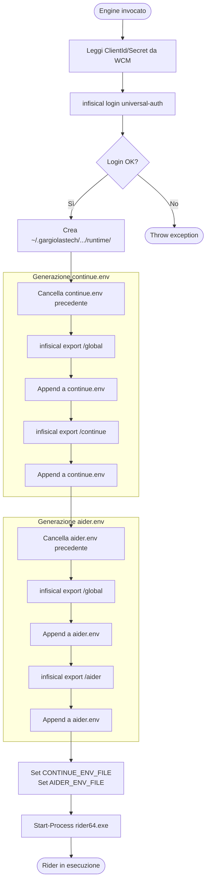
```mermaid
flowchart TB
    Start([Engine invocato])
    ReadWCM["Leggi ClientId/Secret da WCM"]
    Login["infisical login universal-auth"]
    Auth{"Login OK?"}
    PrepareDirs["Crea ~/.gargiolastech/.../runtime/"]
    
    subgraph ContinueFlow["Generazione continue.env"]
        DelContEnv["Cancella continue.env precedente"]
        ExpGlobalC["infisical export /global"]
        AppendGlobalC["Append a continue.env"]
        ExpCont["infisical export /continue"]
        AppendCont["Append a continue.env"]
    end
    
    subgraph AiderFlow["Generazione aider.env"]
        DelAiderEnv["Cancella aider.env precedente"]
        ExpGlobalA["infisical export /global"]
        AppendGlobalA["Append a aider.env"]
        ExpAider["infisical export /aider"]
        AppendAider["Append a aider.env"]
    end
    
    SetEnvVars["Set CONTINUE_ENV_FILE<br/>Set AIDER_ENV_FILE"]
    LaunchRider["Start-Process rider64.exe"]
    End([Rider in esecuzione])

    Start --> ReadWCM
    ReadWCM --> Login
    Login --> Auth
    Auth -->|No| Fail([Throw exception])
    Auth -->|Sì| PrepareDirs
    PrepareDirs --> DelContEnv
    DelContEnv --> ExpGlobalC
    ExpGlobalC --> AppendGlobalC
    AppendGlobalC --> ExpCont
    ExpCont --> AppendCont
    AppendCont --> DelAiderEnv
    DelAiderEnv --> ExpGlobalA
    ExpGlobalA --> AppendGlobalA
    AppendGlobalA --> ExpAider
    ExpAider --> AppendAider
    AppendAider --> SetEnvVars
    SetEnvVars --> LaunchRider
    LaunchRider --> End
```

### 22.6 Considerazioni di performance

Il numero di chiamate HTTP a Infisical è **2 × numero di file .env** (uno per ogni path).

| Configurazione | Chiamate API | Tempo tipico totale |
|---|---|---|
| 2 file .env, 2 path ciascuno | 4 chiamate | ~600-1200ms |
| 3 file .env, 2 path ciascuno | 6 chiamate | ~900-1800ms |

**Ottimizzazione potenziale** (non implementata, future-friendly): bulk export di multipli path in una singola chiamata. Infisical CLI attualmente non supporta multi-path in una invocazione, ma l'API REST sì.

---

## 23. Security best practices

### 23.1 Best practice per developer

| # | Pratica | Razionale |
|---|---|---|
| 1 | **MAI** committare `projects.json` configurato | Contiene paths sensibili dei progetti interni |
| 2 | **MAI** copiare manualmente file `.env` runtime in altre posizioni | Vanifica l'effimeralità |
| 3 | Eseguire `cmdkey /list:gargiolastech-*` periodicamente | Audit delle credenziali memorizzate |
| 4 | Usare BitLocker sul disco del laptop | Difesa per il caso "laptop rubato" |
| 5 | Bloccare la sessione Windows quando ci si allontana | DPAPI è sicuro solo quando la sessione è chiusa |
| 6 | Non condividere account Windows con colleghi | Cross-user DPAPI isolation funziona solo con account separati |
| 7 | Ruotare Machine Identity ogni 90 giorni | Limita finestra di compromissione |
| 8 | Revocare immediatamente Machine Identity in caso di sospetta compromissione | Da fare via Infisical UI, propagazione immediata |

### 23.2 Best practice per platform engineers

| # | Pratica | Razionale |
|---|---|---|
| 1 | Trusted IPs su Machine Identity ristretti a VPN aziendale | Secondo fattore implicito basato sulla rete |
| 2 | Custom Roles con principio del least privilege | Una Machine Identity dev legge `/global`, `/continue`, `/aider`; non altre cartelle |
| 3 | Audit log review periodica su Infisical | Identificare pattern anomali di accesso |
| 4 | Naming convention rigorosa per Machine Identities | `workstation-<user>-<env>` per traceability |
| 5 | Documentare l'ownership di ogni Machine Identity | Sapere chi contattare in caso di alert |
| 6 | Provision automatico via Infisical Terraform Provider | Riproducibilità + audit GitOps |
| 7 | Periodicamente eseguire scan GitLeaks sul repo | Defense in depth, anche se per design non ci sono segreti |
| 8 | Pre-commit hooks per blocco accidentale segreti | Bloccare a monte qualsiasi tentativo |

### 23.3 Pre-commit hook esempio (gitleaks)

```yaml
# .pre-commit-config.yaml
repos:
  - repo: https://github.com/gitleaks/gitleaks
    rev: v8.18.0
    hooks:
      - id: gitleaks
```

Installazione:
```bash
pip install pre-commit
pre-commit install
```

### 23.4 Audit checklist trimestrale

- [ ] Lista delle Machine Identity attive vs developer attivi (HR sync).
- [ ] Lista Client Secrets non ruotati da >90 giorni.
- [ ] Review Trusted IPs (eventuali range nuovi/dismessi).
- [ ] Review dei role assegnati alle Machine Identity vs least-privilege.
- [ ] Audit log Infisical: pattern di accesso anomali (orari, IP, volume).

---

## 24. Strategia `.gitignore`

### 24.1 Filosofia

Il repository è progettato per essere **safe-by-default**: anche in assenza di `.gitignore` non dovrebbero esistere segreti. Tuttavia, una `.gitignore` ben costruita aggiunge un **terzo livello di difesa** (oltre all'architettura runtime-only e ai pre-commit hooks).

### 24.2 `.gitignore` raccomandato per il repository

```gitignore
# ============================================================
# Runtime artifacts (non dovrebbero mai apparire in repo,
# ma blocchiamo a monte per sicurezza)
# ============================================================
*.env
*.env.*
!*.env.template
!*.env.example

# ============================================================
# User-specific runtime files
# ============================================================
**/runtime/
**/.gargiolastech/

# ============================================================
# IDE
# ============================================================
.idea/
.vs/
*.user

# ============================================================
# OS
# ============================================================
Thumbs.db
desktop.ini
.DS_Store

# ============================================================
# PowerShell-generated
# ============================================================
*.log
*.tmp

# ============================================================
# Sensitive configuration overrides
# ============================================================
projects.json
!projects.json.template

# ============================================================
# Credenziali (qualsiasi pattern conosciuto)
# ============================================================
*credentials*
*.pem
*.pfx
*.p12
*.key
secrets/
```

### 24.3 `.gitignore` per progetti consumer (sviluppatori finali)

Su ciascuna **solution** che si apre con questo launcher (es. `C:\dev\quoteflow`), aggiungere a `.gitignore`:

```gitignore
# Runtime files generated by gargiolastech-ai-tooling launcher
.gargiolastech/
runtime/*.env
```

### 24.4 Verifica post-clone

Comando di verifica che nessun file sensibile sia tracciato:

```powershell
git ls-files | Select-String -Pattern '\.env$|\.key$|secrets|credentials'
# Output atteso: vuoto
```

---

## 25. Troubleshooting

### 25.1 Approccio diagnostico

L'architettura ha **punti di fallimento ben identificati**. Diagnosi consigliata:

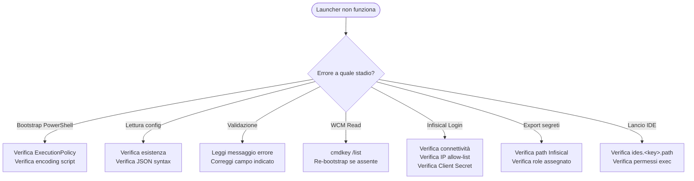
```mermaid
flowchart TD
    Issue([Launcher non funziona]) --> Q1{Errore a quale stadio?}
    Q1 -->|Bootstrap PowerShell| S1["Verifica ExecutionPolicy<br/>Verifica encoding script"]
    Q1 -->|Lettura config| S2["Verifica esistenza<br/>Verifica JSON syntax"]
    Q1 -->|Validazione| S3["Leggi messaggio errore<br/>Correggi campo indicato"]
    Q1 -->|WCM Read| S4["cmdkey /list<br/>Re-bootstrap se assente"]
    Q1 -->|Infisical Login| S5["Verifica connettività<br/>Verifica IP allow-list<br/>Verifica Client Secret"]
    Q1 -->|Export segreti| S6["Verifica path Infisical<br/>Verifica role assegnato"]
    Q1 -->|Lancio IDE| S7["Verifica ides.&lt;key&gt;.path<br/>Verifica permessi exec"]
```

### 25.2 Strumenti di diagnostica

| Strumento | Uso |
|---|---|
| `cmdkey /list:gargiolastech-*` | Verifica esistenza WCM entries |
| `infisical login --method universal-auth --client-id X --client-secret Y` | Test login isolato |
| `infisical export --projectId X --env dev --path /global --format dotenv` | Test export isolato |
| `Get-Content "$env:USERPROFILE\.gargiolastech\ai-tooling\projects.json"` | Inspect config |
| `Test-Path "C:\Program Files\JetBrains\..."` | Verifica path Rider |
| `Test-NetConnection app.infisical.com -Port 443` | Verifica connettività |

### 25.3 Modalità verbose

Per debug dettagliato, aggiungere temporaneamente all'inizio degli script:

```powershell
Set-StrictMode -Version Latest
$VerbosePreference = "Continue"
$DebugPreference = "Continue"
```

E lanciare con `-Verbose`:

```powershell
.\Start-AiIde.ps1 -Verbose
```

---

## 26. Errori comuni e soluzioni

### 26.1 Tabella errori frequenti

| Errore | Causa | Soluzione |
|---|---|---|
| `infisical non trovato` | CLI non installato o non in PATH | `scoop install infisical` oppure aggiungere `infisical.exe` al PATH |
| `ClientId non trovato nel Credential Manager` | Bootstrap non eseguito o WCM corrotto | Rilanciare `bootstrap-ai-tooling.cmd` |
| `Login Infisical fallito` | ClientId/Secret invalidi, IP non whitelisted, sospensione identità | Verificare Infisical UI: identità attiva, IP allow-list corretta |
| `Configurazione non valida: ides è obbligatorio.` | Sezione `ides` mancante nel JSON | Aggiungere sezione `ides` con almeno una entry valida (Sezione 18) |
| `Il progetto '<key>' non ha il campo ide valorizzato.` | Campo `ide` mancante o vuoto nel progetto | Aggiungere `"ide": "rider"` (o altro key) al progetto |
| `IDE '<ide>' non configurato nella sezione ides.` | Il valore di `ide` nel progetto non corrisponde a nessuna chiave in `ides` | Verificare corrispondenza esatta tra `projects[].ide` e chiavi in `ides` |
| `IDE '<ide>' non trovato nel percorso: <path>` | Path eseguibile dell'IDE errato o IDE non installato | Verificare `Get-ChildItem "C:\Program Files\JetBrains\*\bin\rider64.exe"` o equivalente per altri IDE |
| `Nessun file .sln trovato in: ...` | `solutionPath` punta a directory senza `.sln` | Correggere `solutionPath` in `projects.json` |
| `Configurazione non valida: ... non ha infisicalProjectId valorizzato` | Template non personalizzato | Sostituire `REPLACE_WITH_INFISICAL_PROJECT_ID` con il vero project ID |
| `Errore durante export Infisical per path '/X'` | Path non esiste in Infisical, environment errato, role insufficiente | Verificare in UI: path esistente, role con read permission |
| `ExecutionPolicy bloccata` | Policy macchina restrittiva | Lanciare CMD wrapper (usa `-ExecutionPolicy Bypass`) oppure `Set-ExecutionPolicy -Scope CurrentUser RemoteSigned` |
| `Impossibile leggere o parsare il file di configurazione` | JSON malformato | Validare con `Get-Content projects.json \| ConvertFrom-Json` |
| `key duplicata` | Due progetti con stesso `key` | Renaming progetto |
| `Python launcher 'py' not found.` (Install-Aider) | Python Launcher Windows non installato | Reinstallare Python da python.org assicurandosi che "Install launcher for all users" sia selezionato |
| `Python <version> not found.` (Install-Aider) | Versione Python richiesta non installata | Installare la versione richiesta oppure usare `-PythonVersion <altra>` |
| `Failed to upgrade pip tooling.` (Install-Aider) | Problemi rete, proxy aziendale, certificati corporate non riconosciuti da pip | Configurare `pip.ini` con `index-url` aziendale e certificato CA |
| `Failed to install aider-chat.` (Install-Aider) | Stessa diagnosi di sopra; oppure dipendenza nativa che fallisce build | Verificare log pip; su Windows 10 vecchi può servire C++ Build Tools per alcune dipendenze |
| `Aider executable not found after installation` (Install-Aider) | Virtualenv corrotto o creazione fallita silenziosamente | Rilanciare con `-ForceRecreate` |
| `Aider verification failed.` (Install-Aider) | Aider installato ma `--version` fallisce | Investigare log; spesso correlato a versione Python non supportata da Aider (vedi release notes Aider) |

### 26.2 Esempi di sessione di troubleshooting

#### Esempio 1: WCM Entry mancante

```powershell
PS> .\Start-AiIde.cmd
[...]
============================================================
 AI IDE Bootstrap
============================================================
Errore: ClientId non trovato nel Credential Manager. Scope: gargiolastech-ai-tooling-dev

# Diagnosi:
PS> cmdkey /list:gargiolastech-ai-tooling-dev-client-id
# Output:
# Currently stored credentials:
# * NONE *

# Soluzione:
PS> .\bootstrap-ai-tooling.cmd
# Reinserire ClientId e ClientSecret
```

#### Esempio 2: Login Infisical fallito

```powershell
PS> .\Start-AiIde.cmd
[...]
============================================================
 Login Infisical
============================================================
Errore: Login Infisical fallito.

# Diagnosi: test isolato
PS> $env:INFISICAL_API_URL = "https://app.infisical.com"
PS> infisical login --method universal-auth --client-id "<id>" --client-secret "<secret>"
# Output: 401 Unauthorized

# Soluzione: aprire Infisical UI, verificare:
# - Machine Identity attiva
# - Client Secret non revocato
# - IP attuale in allow-list (se restritto)
```

#### Esempio 3: Path Infisical non trovato

```powershell
PS> .\Start-AiIde.cmd
[...]
Export secret path: /aider
Errore durante export Infisical per path '/aider'.

# Diagnosi:
PS> infisical secrets --projectId "<id>" --env dev --path /aider
# Output: Path /aider does not exist

# Soluzione: creare il path in Infisical UI oppure rimuovere la dipendenza dallo script
```

### 26.3 Sintomi non-fatali ma da investigare

| Sintomo | Possibile causa | Investigazione |
|---|---|---|
| Continue mostra "API key not found" | `continue.env` vuoto o non letto | Verificare contenuto `continue.env`, verificare `$env:CONTINUE_ENV_FILE` ereditato da Rider |
| Aider funziona, Continue no | Plugin Continue non legge `CONTINUE_ENV_FILE` | Verificare config Continue, verificare versione plugin |
| Avvio molto lento (>10s) | Latenza rete verso Infisical | `Test-NetConnection app.infisical.com -Port 443`, verificare DNS |
| Rider apre la directory invece del .sln | Più `.sln` nella directory | Comportamento atteso; selezionare manualmente nell'IDE |

---

## 27. Come aggiungere un nuovo progetto

### 27.1 Procedura step-by-step

#### Step 1 — Verifica preliminari

- Il progetto applicativo esiste in Infisical (Sezione 12)? Se no, crearlo.
- La Machine Identity esistente ha role sul nuovo progetto Infisical? Se no, assegnarlo.

#### Step 2 — Aggiunta a `projects.json`

Aprire `~/.gargiolastech/ai-tooling/projects.json` e aggiungere un elemento all'array `projects`:

```json
{
  "key": "payments",
  "name": "Payments Gateway",
  "ide": "rider",
  "solutionPath": "C:\\dev\\payments-gateway",
  "infisicalProjectId": "11223344-5566-7788-99aa-bbccddeeff00"
}
```

> **Nota multi-IDE**: il campo `ide` è obbligatorio dalla v2.0. Il valore deve corrispondere a una chiave esistente nella sezione `ides` di `projects.json`. Se l'IDE che si vuole usare non è ancora configurato, aggiungerlo prima nella sezione `ides` (Sezione 18).

#### Step 3 — Validazione

```powershell
.\Start-AiIde.ps1 -List
```

Output atteso: il nuovo progetto deve apparire nella lista. Errori di validazione sono fail-fast con messaggi specifici (vedi Sezione 26).

#### Step 4 — Test di avvio

```powershell
.\Start-AiIde.ps1 -ProjectKey payments
```

Se tutto è configurato correttamente, l'IDE associato al progetto si avvia con i segreti AI iniettati.

### 27.2 Pattern enterprise: distribuire `projects.json` via tool aziendale

In team grandi, è raccomandabile **non far gestire** `projects.json` manualmente ai developer. Pattern possibili:

| Pattern | Descrizione | Pro | Contro |
|---|---|---|---|
| Script di sync | Script PS che pulla `projects.json` da repo interno privato e lo copia in `~/.gargiolastech/` | Centralizzato, versionato | Richiede aggiornamento esplicito |
| Configurazione policy GPO | Microsoft Group Policy distribuisce il file | Automatico, governato | Coupling con AD/AAD |
| ETL da knowledge base interna | Genera `projects.json` da CMDB/ServiceNow | Single source of truth | Complessità di setup |

Esempio di script di sync:

```powershell
# Sync-AiToolingProjects.ps1
$internalRepoUrl = "https://internal-git.company.com/devex/ai-tooling-config.git"
$tempDir = Join-Path $env:TEMP "ai-tooling-sync"
$destDir = Join-Path $env:USERPROFILE ".gargiolastech\ai-tooling"

git clone --depth 1 $internalRepoUrl $tempDir
Copy-Item -Path "$tempDir\projects.json" -Destination "$destDir\projects.json" -Force
Remove-Item -Recurse -Force $tempDir
```

---

## 28. Rotazione delle credenziali Machine Identity

### 28.1 Frequenza raccomandata

| Ambiente | Frequenza rotazione Client Secret |
|---|---|
| `dev` | Ogni 90 giorni (raccomandato) |
| `staging` | Ogni 60 giorni |
| `prod` (CI/CD) | Ogni 30 giorni |
| **Emergency** | Immediata, su sospetto compromissione |

### 28.2 Procedura di rotazione planned

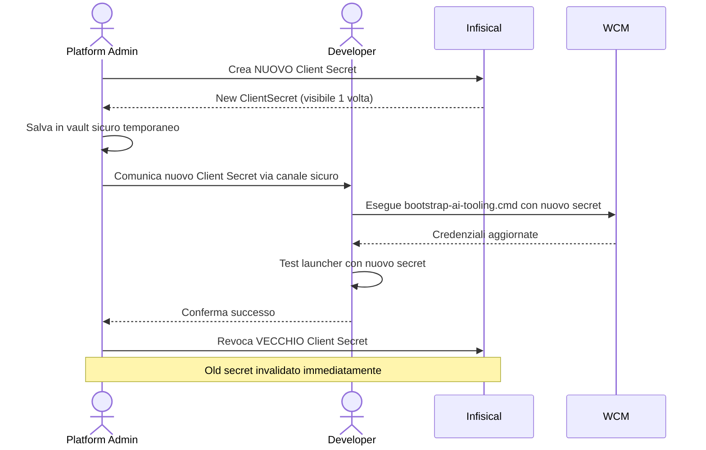
```mermaid
sequenceDiagram
    actor Admin as Platform Admin
    actor Dev as Developer
    participant Infisical
    participant WCM

    Admin->>Infisical: Crea NUOVO Client Secret
    Infisical-->>Admin: New ClientSecret (visibile 1 volta)
    Admin->>Admin: Salva in vault sicuro temporaneo
    Admin->>Dev: Comunica nuovo Client Secret via canale sicuro
    Dev->>WCM: Esegue bootstrap-ai-tooling.cmd con nuovo secret
    WCM-->>Dev: Credenziali aggiornate
    Dev->>Dev: Test launcher con nuovo secret
    Dev-->>Admin: Conferma successo
    Admin->>Infisical: Revoca VECCHIO Client Secret
    Note over Admin,Infisical: Old secret invalidato immediatamente
```

### 28.3 Comandi operativi

#### Lato Infisical (UI)

1. Naviga Machine Identity.
2. `Client Secrets → Add Client Secret`.
3. Annota descrizione: `rotation YYYY-MM-DD`.
4. Copia il nuovo secret.
5. **NON** revocare ancora il vecchio.

#### Lato workstation developer

```powershell
# Rimuove credenziali vecchie
cmdkey /delete:gargiolastech-ai-tooling-dev-client-id
cmdkey /delete:gargiolastech-ai-tooling-dev-client-secret

# Bootstrap con nuove credenziali
.\bootstrap-ai-tooling.cmd
# (Inserire Client ID e nuovo Client Secret)

# Verifica
cmdkey /list:gargiolastech-ai-tooling-dev-client-id
cmdkey /list:gargiolastech-ai-tooling-dev-client-secret

# Test funzionale
.\Start-AiIde.ps1 -List
```

#### Lato Infisical (cleanup)

Dopo che tutti i developer hanno confermato la rotazione:

1. Naviga Machine Identity.
2. `Client Secrets → vecchio secret → Revoke`.
3. Conferma.

### 28.4 Procedura di rotazione emergency

In caso di sospetta compromissione:

1. **Revoca immediata** del Client Secret compromesso in Infisical UI (decisione istantanea, no wait window).
2. **Generazione** di un nuovo Client Secret.
3. **Notifica** developer via canale sicuro.
4. **Audit** dei log Infisical per identificare accessi sospetti antecedenti la revoca.
5. **Considerare** la rotazione **dei segreti AI sottostanti** (es. ricreare OpenAI API key) se il segreto era esposto da abbastanza tempo da temere data exfil.

### 28.5 Rotazione delle Machine Identity (intera)

Caso più raro: si vuole sostituire l'intera Machine Identity (non solo il secret).

1. Crea **nuova Machine Identity** in Infisical (es. `workstation-alice-dev-v2`).
2. Assegna lo stesso role della precedente.
3. Comunica al developer i nuovi Client ID e Client Secret.
4. Developer esegue bootstrap.
5. Una volta verificato il funzionamento, **disattiva e cancella** la vecchia Machine Identity.

---

## 29. Estendibilità futura

Il repository è progettato come **MVP estensibile**. Identifichiamo le direzioni di estensione naturali.

### 29.1 Estensione: Override per-progetto del `credentialScope`

**Caso d'uso**: progetto "high-trust" che usa una Machine Identity diversa dagli altri.

**Modifica proposta** a `projects.json`:

```json
{
  "key": "payments",
  "name": "Payments Gateway (high-trust)",
  "solutionPath": "...",
  "infisicalProjectId": "...",
  "credentialScope": "gargiolastech-payments-prod"
}
```

**Modifica engine**: nello script, leggere `$selected.credentialScope` con fallback al root.

### 29.2 Estensione: Path Infisical personalizzati per progetto

**Caso d'uso**: alcuni progetti hanno path Infisical non standard (es. `/llm-gateway` per progetti che usano LiteLLM custom).

**Modifica proposta**:

```json
{
  "key": "wcm",
  "name": "...",
  "infisicalProjectId": "...",
  "continuePaths": ["/global", "/continue", "/wcm-overrides"],
  "aiderPaths": ["/global", "/aider"]
}
```

### 29.3 Estensione: Wrapper Linux/macOS

**Caso d'uso**: team eterogeneo con macchine Mac (es. designer che usano AI tools).

**Approccio**:
- Sostituire WCM con **macOS Keychain** (via `security` CLI) o **libsecret** (Linux, Gnome Keyring).
- Riscrivere gli script in **bash/zsh** o, meglio, in **PowerShell Core 7+** (cross-platform).
- Astrarre il "credential store" dietro un'interfaccia comune.

### 29.4 Estensione: Support a VS Code/Cursor — ⚠️ già abilitata in v2.0 a livello config

**Stato attuale**: l'engine è già IDE-agnostic (`-IdeType`, `-IdePath`). Aggiungere VS Code o Cursor richiede **solo modifiche dichiarative** in `projects.json`:

```json
{
  "ides": {
    "vscode": {
      "path": "C:\\Users\\<user>\\AppData\\Local\\Programs\\Microsoft VS Code\\Code.exe"
    },
    "cursor": {
      "path": "C:\\Users\\<user>\\AppData\\Local\\Programs\\cursor\\Cursor.exe"
    }
  },
  "projects": [
    { "key": "frontend", "ide": "vscode", ... },
    { "key": "data-science", "ide": "cursor", ... }
  ]
}
```

**Lavoro residuo** (per maturità completa):

- Validazione che il plugin Continue esista nell'IDE selezionato (al momento c'è solo controllo sul path).
- Supporto a CLI args diversi se l'IDE non accetta `<ide.exe> "<path>"` come sintassi standard (es. VS Code usa `code --new-window`).
- Helper per discovery automatica del path eseguibile di IDE comuni (`Get-IdeInstallation -Type vscode`).

### 29.5 Estensione: Caching dei segreti per modalità offline

**Caso d'uso**: developer in volo.

**Approccio**:
- Aggiungere flag `-AllowStaleCache` allo script.
- Se Infisical non raggiungibile, riutilizzare i file `.env` runtime esistenti se aged <N ore.
- Warning evidente all'utente.

**Trade-off di sicurezza**: rompe il principio di effimeralità. Va abilitato esplicitamente, non per default.

### 29.6 Estensione: LiteLLM Gateway centrale

Per ridurre il rischio di esposizione di chiavi AI dirette agli sviluppatori, l'organizzazione può deployare un **LiteLLM gateway centrale**:

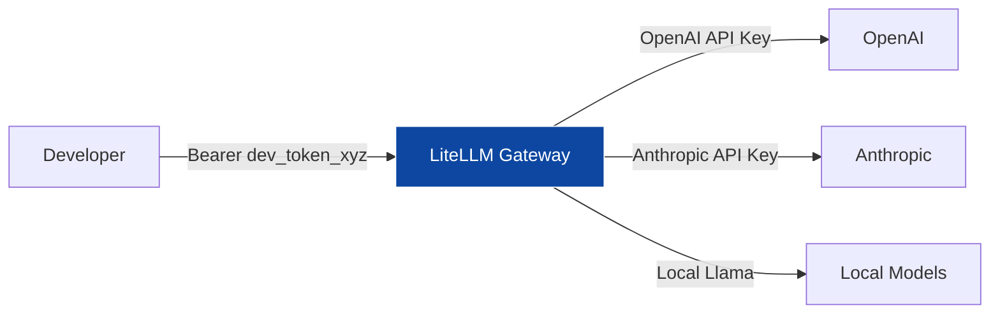
```mermaid
flowchart LR
    Dev["Developer"] -->|"Bearer dev_token_xyz"| LL["LiteLLM Gateway"]
    LL -->|"OpenAI API Key"| OAI["OpenAI"]
    LL -->|"Anthropic API Key"| ANT["Anthropic"]
    LL -->|"Local Llama"| LOC["Local Models"]

    style LL fill:#0d47a1,stroke:#fff,color:#fff
```

In questo modello:
- I segreti in Infisical contengono solo il `LITELLM_BASE_URL` e un `LITELLM_VIRTUAL_KEY` per-developer.
- I veri segreti dei provider AI (OpenAI, Anthropic) vivono **solo** nel gateway LiteLLM, in un secret store dedicato (es. Vault).
- Audit centralizzato di tutti i prompt che escono dall'azienda.

### 29.7 Estensione: Telemetria e usage tracking

Inserire nello script engine un endpoint POST verso un servizio interno per tracciare:

- Frequency d'uso per developer.
- Path Infisical più consumati.
- Latenze tipiche.
- Distribuzione di utilizzo per IDE (Rider vs VS vs altri).

**Rispetto privacy**: zero prompt logging, zero contenuto codice. Solo metadati operazionali.

### 29.8 Estensione: Argomenti per-IDE configurabili

**Caso d'uso**: alcuni IDE accettano argomenti aggiuntivi all'avvio (es. VS Code con `--new-window`, Rider con `--wait` per integrazione con altri tool).

**Modifica proposta** a `projects.json`:

```json
"ides": {
  "vscode": {
    "path": "C:\\...\\Code.exe",
    "args": ["--new-window", "--disable-telemetry"]
  },
  "rider": {
    "path": "C:\\...\\rider64.exe",
    "args": []
  }
}
```

**Modifica engine**: estendere il `Start-Process` per concatenare `args` di IDE con il `targetPath` calcolato.

### 29.9 Estensione: Discovery automatica path IDE

**Caso d'uso**: ridurre l'attrito di configurazione iniziale. Anziché chiedere al developer di scoprire manualmente `rider64.exe`, lo script esegue auto-discovery.

**Approccio**:

```powershell
function Find-IdeInstallation {
    param([string]$IdeType)

    switch ($IdeType) {
        "rider" {
            return Get-ChildItem `
                "$env:ProgramFiles\JetBrains\*\bin\rider64.exe",
                "$env:LOCALAPPDATA\Programs\Rider\bin\rider64.exe" `
                -ErrorAction SilentlyContinue |
                Select-Object -First 1 -ExpandProperty FullName
        }
        "visualstudio" {
            # Usa vswhere per discovery affidabile di Visual Studio
            $vswhere = "$env:ProgramFiles(x86)\Microsoft Visual Studio\Installer\vswhere.exe"
            return & $vswhere -latest -property productPath
        }
    }
}
```

Da invocare al primo avvio per popolare automaticamente `ides[<type>].path`.

---

## 30. Folder structure raccomandata

### 30.1 Workstation developer

```
C:\Users\<utente>\
├── .gargiolastech\
│   └── ai-tooling\
│       ├── projects.json                      ← Configurazione locale
│       └── runtime\                            ← File effimeri
│           ├── continue.env
│           └── aider.env
├── .continue\
│   └── config.json                             ← Config Continue (gestita da plugin)
└── .venvs\
    └── aider-env\                              ← Virtualenv Python isolato per Aider
        ├── Lib\
        ├── Scripts\
        │   ├── aider.exe                       ← Eseguibile Aider
        │   ├── pip.exe
        │   └── python.exe                      ← Python del venv
        └── pyvenv.cfg

C:\dev\
├── gargiolastech-ai-tooling\                   ← Repo del launcher
├── gargiolastech-devex-wcm\                    ← Progetto applicativo 1
├── quoteflow\                                  ← Progetto applicativo 2
└── payments-gateway\                           ← Progetto applicativo 3
```

### 30.2 Repository AI tooling (estensione futura)

```
gargiolastech-ai-tooling/
├── LICENSE
├── README.md
├── CHANGELOG.md                                ← Versioning del launcher
├── docs/
│   └── DOCUMENTATION.md                        ← Documentazione enterprise (corrente)
├── images/
│   ├── Icona.ico                               ← Icona launcher (corrente)
│   └── Icona.png                               ← Asset PNG (corrente)
├── continue/                                   ← Estensione futura
│   ├── config.template.json                    ← Template Continue config
│   └── rules/                                  ← Custom rules per Continue
│       ├── csharp-style.md
│       └── dotnet-best-practices.md
├── aider/                                      ← Estensione futura
│   ├── .aider.conf.yml.template                ← Template config Aider
│   └── system-prompts/
│       └── senior-backend.md
├── prompts/                                    ← Estensione futura
│   ├── refactoring/
│   ├── code-review/
│   └── documentation/
├── scripts/
│   ├── windows/                                ← Esistenti (Start-AiIde.*, etc.)
│   ├── linux/                                  ← Future
│   └── macos/                                  ← Future
├── templates/
│   ├── projects.json.template                  ← Corrente (schema v2.0 con ides)
│   └── projects.schema.json                    ← Estensione futura: JSON Schema per validation
└── .github/
    └── workflows/
        ├── lint-scripts.yml                    ← PSScriptAnalyzer
        └── validate-templates.yml              ← Test JSON schema
```

---

## 31. Enterprise considerations

### 31.1 Conformità

#### GDPR / Privacy

| Aspetto | Stato |
|---|---|
| Dati personali su workstation | Solo Client ID (UUID), nessun PII |
| Dati personali in Infisical | Nome Machine Identity contiene `<user>` per traceability — considerare se rientra in PII |
| Log access | Conservazione log Infisical secondo retention policy aziendale |
| Right-to-be-forgotten | Disattivazione Machine Identity + audit log purge dopo retention |

#### ISO 27001 / SOC 2

| Controllo | Evidenza |
|---|---|
| Access control to secrets | Machine Identity con least privilege role |
| Rotation policy | Documentata in Sezione 28 |
| Audit logging | Audit log Infisical, retention configurata |
| Encryption at rest | DPAPI (workstation) + Infisical (cloud) |
| Encryption in transit | HTTPS only verso Infisical |
| Onboarding/offboarding | Provisioning/revoke Machine Identity |

### 31.2 Multi-tenant considerations

In contesti **MSP** (Managed Service Provider) o di **sviluppo per più clienti**, il modello è scalabile usando:

- **Organizations** in Infisical per separare i clienti.
- **CredentialScope** distinti per cliente (es. `acme-ai-tooling-dev`, `globex-ai-tooling-dev`).
- **`projects.json` separati** per cliente (con `-ConfigPath` esplicito).

Esempio:

```powershell
.\Start-AiIde.ps1 -ConfigPath "$env:USERPROFILE\.gargiolastech\customers\acme\projects.json"
```

### 31.3 Disaster Recovery

| Scenario | Impatto | RTO/RPO |
|---|---|---|
| Workstation persa/rubata | Single developer | RTO: 30 min (bootstrap) |
| Infisical SaaS down | Tutto il team | RTO: dipende da SLA Infisical, mitigato da cached IDE sessions |
| Compromissione Machine Identity | Singolo developer | RTO: 5 min (revoca + ricreazione) |
| Compromissione di **tutti** i segreti AI | Tutto il team + costo provider AI | Richiede rotazione di tutte le API key, ~1h |

### 31.4 Cost considerations

| Voce | Costo tipico |
|---|---|
| Infisical SaaS (team plan) | $X/user/mese (consultare pricing aggiornato) |
| Infisical self-hosted | Costo infrastrutturale (~1 VM small) |
| AI API providers (OpenAI/Anthropic) | Variabile, controllato via LiteLLM rate-limiting raccomandato |
| Manutenzione DevEx | ~1 FTE-week per quarter |

### 31.5 SLA implicit

| Componente | Disponibilità tipica |
|---|---|
| WCM (locale) | 100% (offline-capable) |
| Infisical SaaS | 99.9% (consultare SLA ufficiale) |
| OpenAI/Anthropic | 99.5%+ (consultare SLA ufficiale) |

**Conseguenza per developer**: se Infisical down → launcher non funziona, ma sessioni IDE già aperte continuano (i file `.env` runtime sono già su disco).

---

## 32. CI/CD considerations

### 32.1 Posizionamento di questo repo rispetto a CI/CD

**Importante**: questo repository **non è un'applicazione**, non viene deployato. È un **set di artefatti distribuiti per workstation developer**.

| Cosa CI/CD fa | Cosa NON fa |
|---|---|
| Lint PowerShell con PSScriptAnalyzer | Build di binari |
| Validate JSON template | Deploy in produzione |
| Test funzionali su VM Windows | Distribuzione segreti |
| Pubblicazione release tag | Esecuzione effettiva del launcher |

### 32.2 GitHub Actions consigliato

Esempio di workflow per lint + validation:

```yaml
# .github/workflows/lint.yml
name: Lint & Validate

on: [push, pull_request]

jobs:
  lint-powershell:
    runs-on: windows-latest
    steps:
      - uses: actions/checkout@v4
      - name: Install PSScriptAnalyzer
        shell: pwsh
        run: |
          Install-Module -Name PSScriptAnalyzer -Force -Scope CurrentUser
      - name: Lint scripts
        shell: pwsh
        run: |
          Invoke-ScriptAnalyzer -Path scripts/ -Recurse -EnableExit

  validate-templates:
    runs-on: ubuntu-latest
    steps:
      - uses: actions/checkout@v4
      - name: Setup Node
        uses: actions/setup-node@v4
        with:
          node-version: '20'
      - name: Install ajv
        run: npm install -g ajv-cli
      - name: Validate projects.json.template
        run: |
          # Usa lo schema in templates/projects.schema.json (se presente)
          ajv validate -s templates/projects.schema.json -d templates/projects.json.template

  scan-secrets:
    runs-on: ubuntu-latest
    steps:
      - uses: actions/checkout@v4
        with:
          fetch-depth: 0
      - name: GitLeaks
        uses: gitleaks/gitleaks-action@v2
        env:
          GITHUB_TOKEN: ${{ secrets.GITHUB_TOKEN }}
```

### 32.3 Release flow consigliato

```mermaid
flowchart LR
    Dev["Push su feature branch"] --> PR["Pull Request"]
    PR --> Lint["GH Actions: lint + validate + secrets scan"]
    Lint -->|OK| Review["Code Review"]
    Review --> Merge["Merge to main"]
    Merge --> Tag["Manual tag vX.Y.Z"]
    Tag --> Release["GitHub Release"]
    Release --> Notify["Notify developers (Slack/email)"]
```

### 32.4 GitOps per `projects.json` aziendale

Pattern **avanzato** per organizzazioni con più di ~20 developer:

```mermaid
flowchart TB
    GitInternal["Internal Git: ai-tooling-config"]
    Dev["Developer workstation"]
    Sync["Script Sync-AiToolingProjects.ps1"]
    Local["~/.gargiolastech/ai-tooling/projects.json"]

    GitInternal -->|"git pull"| Sync
    Sync --> Local
    Dev --> Sync
```

**Vantaggi**:
- Aggiunte/rimozioni di progetti sono **pull request**, con review e audit trail.
- Onboarding nuovi developer: clone iniziale del config + bootstrap WCM.
- Rollback semplice: revert del commit + re-sync.

### 32.5 Non-CI/CD ma operationally relevant: ArgoCD per LiteLLM gateway

Se l'organizzazione gestisce un **LiteLLM gateway centrale** (Sezione 29.6), questo è un'applicazione vera e propria che merita pipeline GitOps:

```yaml
# argo/applications/litellm-gateway.yaml
apiVersion: argoproj.io/v1alpha1
kind: Application
metadata:
  name: litellm-gateway
  namespace: argocd
spec:
  project: ai-platform
  source:
    repoURL: https://internal-git.company.com/devex/litellm-gateway.git
    targetRevision: main
    path: deploy/k8s
  destination:
    server: https://kubernetes.default.svc
    namespace: ai-platform
  syncPolicy:
    automated:
      prune: true
      selfHeal: true
```

I segreti del gateway sono iniettati via **Infisical Operator** o **External Secrets Operator** dal cluster verso il namespace.

---

## 33. Developer onboarding guide

### 33.1 Checklist onboarding (15 minuti)

Per un nuovo developer:

- [ ] **Step 1** — IT crea account in Infisical e ottiene email di invito.
- [ ] **Step 2** — Platform engineer crea Machine Identity dedicata e assegna ai progetti necessari.
- [ ] **Step 3** — Platform engineer comunica al developer (via canale sicuro: 1Password Sharing, Bitwarden Send, file `.gpg`):
  - Client ID
  - Client Secret
  - Lista progetti (Project ID, nomi)
- [ ] **Step 4** — Developer installa prerequisiti: IDE preferito (Rider e/o Visual Studio 2022), Infisical CLI, Git, Python 3.12 (con Python Launcher), Continue plugin per l'IDE selezionato.
- [ ] **Step 5** — Developer clona il repo `gargiolastech-ai-tooling`.
- [ ] **Step 6** — Developer esegue `bootstrap-ai-tooling.cmd` e inserisce le credenziali.
- [ ] **Step 7** — Developer esegue `Install-Aider.cmd` per provisioning del virtualenv Aider.
- [ ] **Step 8** — Developer esegue `Start-AiIde.cmd` (primo avvio crea config).
- [ ] **Step 9** — Developer edita `projects.json` con i propri progetti.
- [ ] **Step 10** — Developer esegue di nuovo `Start-AiIde.cmd` e verifica che l'IDE selezionato per il progetto si apra con Continue funzionante.
- [ ] **Step 11** — Developer esegue `Install-AiIdeDesktopShortcut.ps1` per shortcut sul desktop.
- [ ] **Step 12** — Developer firma documento di acknowledgment delle security best practices.

### 33.2 Comando "all-in-one" per onboarding

Per accelerare, distribuire uno script bootstrap che combini tutti gli step:

```powershell
# Onboard-Developer.ps1 (esempio)
param(
    [Parameter(Mandatory=$true)][string]$ClientId,
    [Parameter(Mandatory=$true)][string]$ClientSecret
)

$repoDir = "C:\dev\gargiolastech-ai-tooling"
$scriptDir = "$repoDir\scripts\windows"

# 1. Clone repo se non presente
if (-not (Test-Path $repoDir)) {
    git clone https://github.com/gargiolastech/gargiolastech-ai-tooling.git $repoDir
}

# 2. Bootstrap WCM (credenziali Machine Identity)
& "$scriptDir\Set-InfisicalCredential.ps1" `
    -CredentialScope "gargiolastech-ai-tooling-dev" `
    -ClientId $ClientId `
    -ClientSecret $ClientSecret

# 3. Provisioning Aider (virtualenv isolato)
& "$scriptDir\Install-Aider.ps1"

# 4. Trigger primo avvio (genera projects.json)
& "$scriptDir\Start-AiIde.ps1"

# 5. Installa shortcut
& "$scriptDir\Install-AiIdeDesktopShortcut.ps1"

Write-Host "Onboarding completato. Personalizza projects.json e riavvia il launcher."
```

### 33.3 Materiale formativo raccomandato

| Argomento | Risorsa |
|---|---|
| Concetti DDD, Clean Architecture | Eric Evans, Vaughn Vernon |
| Threat modeling | Adam Shostack, "Threat Modeling: Designing for Security" |
| Infisical | Documentazione ufficiale Infisical |
| PowerShell sicuro | Microsoft Learn — "PowerShell security" |
| Continue.dev | continue.dev/docs |
| Aider | aider.chat/docs |

### 33.4 Punto di contatto interno

In una org enterprise, designare:

- **Platform Engineering Team**: responsabile della manutenzione del launcher.
- **Security Team**: review delle Machine Identity, rotation policy.
- **DevEx Champion**: punto di contatto interno per supporto sui tool AI.

Documentare nel `README.md` del repo il canale Slack/Teams per richieste.

---

## 34. FAQ

### Q1: Perché non usare semplicemente un `.env` con `gitignore`?

**A**: Il rischio non è tecnico ma umano. Anche con `.gitignore`:
- Un developer può copiare il `.env` in altro repo e committarlo.
- Un screen sharing rivela il contenuto.
- Un'analisi del file system durante un'audit lo trova.
- Una rotazione segreti richiede notifica e re-distribuzione a tutti i developer.

Il runtime-only approach **elimina la classe di problemi**, non la mitiga.

### Q2: Cosa succede se Infisical è down?

**A**: Il launcher fallisce all'avvio. Tuttavia:
- Le sessioni IDE già aperte continuano a funzionare (i file `.env` runtime sono già in memoria di Continue/Aider).
- Il fallback raccomandato per work-from-anywhere è descritto in Sezione 9.5.

### Q3: Posso usare Vault HashiCorp invece di Infisical?

**A**: Tecnicamente sì, ma richiede riscrittura dello script engine per:
- Sostituire `infisical login` e `infisical export` con `vault login` e `vault kv get`.
- Adattare il formato di output (Vault restituisce JSON, va trasformato in dotenv).

L'architettura di alto livello (WCM + runtime ephemeral) rimane identica.

### Q4: Posso ridurre la finestra di esposizione dei file `.env` runtime?

**A**: Sì, opzioni:
- Cancellare i file alla chiusura di Rider con un task scheduler (richiede polling).
- Usare un **RAM disk** per la cartella `runtime/` (richiede tool come ImDisk).
- Usare nomi file univoci per sessione + cleanup all'avvio successivo.

Per la maggior parte dei team il design attuale è sufficiente.

### Q5: Perché non Kubernetes Secrets / AWS Secrets Manager per le workstation?

**A**: La workstation developer non ha identità native verso questi sistemi. Sarebbe richiesto un proxy di autenticazione (federazione SSO → STS → assume role → fetch secret) molto più complesso del modello attuale Machine Identity.

### Q6: Posso eseguire più istanze di IDE simultaneamente per più progetti?

**A**: Sì. Ogni invocazione di `Start-AiIde.ps1` genera i file `.env` runtime **sovrascrivendo** la versione precedente. Se apri due IDE (anche eterogenei: es. Rider per un progetto e Visual Studio per un altro) in sequenza:
- Il primo IDE è già stato avviato con i suoi `.env` letti all'apertura.
- Il secondo IDE sovrascrive i `.env`, ma legge i suoi al proprio avvio.
- I due processi IDE non si interferiscono runtime (i plugin hanno cache in-memory).

Edge case: se chiudi il primo IDE e lo riapri (con re-launch del plugin Continue) **senza ripassare dal launcher**, leggerà gli `.env` ora appartenenti al secondo progetto. **Workaround**: usare sempre il launcher per ogni apertura.

### Q6.1: Cosa succede se due progetti usano IDE diversi e li avvio contemporaneamente?

**A**: Funziona correttamente. L'engine produce gli stessi file `continue.env` e `aider.env` indipendentemente dall'IDE: i plugin Continue/Aider leggono il file una sola volta all'avvio dell'IDE. Quindi:
- Avvio progetto A su Rider → `.env` scritti con segreti di A → Rider apre e legge.
- Avvio progetto B su Visual Studio → `.env` sovrascritti con segreti di B → VS apre e legge.
- Rider continua a usare i segreti di A (che ha in cache), VS quelli di B.

Se i segreti AI sono gli stessi tra A e B (perché provengono da `/global`), l'overwrite è idempotente. Se differiscono per via di `/continue-A` vs `/continue-B`, c'è un trade-off di sicurezza: l'IDE che ha letto per primo mantiene segreti diversi da quelli ora su disco. Per la maggior parte degli use case è accettabile.

### Q7: Come gestire ambienti staging/prod?

**A**: Usare `credentialScope` e `environment` differenti:

```json
{
  "credentialScope": "gargiolastech-ai-tooling-staging",
  "environment": "staging",
  ...
}
```

Mantenere `projects.json` separati (`projects.dev.json`, `projects.staging.json`) e invocare con `-ConfigPath`.

### Q8: Lo script funziona anche in Windows PowerShell 5.1?

**A**: Sì. Lo script è scritto per essere compatibile con Windows PowerShell 5.1 (preinstallato su tutti i Windows 10/11). Funziona anche con PowerShell Core 7+ con minime considerazioni di encoding.

### Q9: Posso distribuire il launcher come MSI installer?

**A**: Sì, è un'estensione futura. Tool consigliati: **WiX Toolset** o **MSIX Packaging Tool**. L'installer dovrebbe:
- Copiare script in `%ProgramFiles%\GargiolasTech\AiTooling\`.
- Aggiungere al PATH (opzionale).
- Registrare il file handler per `.airider` (custom file extension).

### Q10: Quanto è invasivo questo setup per il developer?

**A**: Bootstrap iniziale: ~5 minuti. Uso quotidiano: doppio click sull'icona desktop, identico a lanciare Rider direttamente. La differenza percepita è solo l'aggiunta di ~2-3 secondi all'avvio e la lista interattiva dei progetti.

### Q11: Cosa succede se eseguo il bootstrap due volte con credenziali diverse?

**A**: La seconda esecuzione **sovrascrive** la prima. WCM mantiene una sola coppia attiva per target name. Il vecchio valore non è recuperabile (è cifrato, e DPAPI non offre versioning).

### Q12: I file `.env` runtime sono leggibili da altri utenti della macchina?

**A**: Sì, **se l'utente ha permessi NTFS sulla cartella `%USERPROFILE%`**. Per default, su Windows multi-utente, ogni profilo utente ha la propria cartella `%USERPROFILE%` con ACL restrittiva. Però:
- Un utente con permessi admin può leggere qualsiasi profilo.
- Un utente con permessi `SeBackupPrivilege` può aggirare le ACL.

**Mitigazione**: la macchina dovrebbe essere single-user o, in caso multi-user, gli account devono essere distinti per developer (no account condivisi).

### Q13: Come gestire un developer che lavora su Linux/macOS in team misto?

**A**: Vedi Sezione 29.3. Per ora, il repository copre solo Windows. Estensione cross-platform è naturale ma richiede sviluppo.

### Q14: Cosa fare se il Client Secret è esposto su Slack per errore?

**A**: Procedura emergency (Sezione 28.4):
1. Revoca **immediata** del Client Secret in Infisical UI.
2. Generazione nuovo Client Secret.
3. Re-bootstrap su tutte le workstation interessate.
4. Audit log Infisical: verifica se ci sono stati accessi sospetti.
5. Pulizia del messaggio Slack (eliminazione + retention policy verifica).
6. Considerare se rotare anche le **API key AI sottostanti**, in base al tempo di esposizione.

### Q15: Posso testare il launcher senza un vero account Infisical?

**A**: Per test funzionali sì, con un'istanza Infisical self-hosted in Docker:

```bash
docker run --rm -p 8080:8080 \
  -e ENCRYPTION_KEY=... \
  -e AUTH_SECRET=... \
  infisical/infisical:latest
```

E configurando `infisicalHost: "http://localhost:8080"` in `projects.json`.

### Q16: Come faccio a far funzionare il launcher con un IDE non listato (es. Neovim)?

**A**: Aggiungere una entry in `ides`:

```json
"ides": {
  "neovim": {
    "path": "C:\\Program Files\\Neovim\\bin\\nvim-qt.exe"
  }
}
```

E nei progetti che vogliono usarlo: `"ide": "neovim"`. **Caveat**: il launcher invoca l'IDE con la sintassi `<exe> "<path>"`. Per IDE che richiedono comandi diversi (es. `code --new-window`, `cursor --reuse-window`), serve l'estensione descritta in Sezione 29.8 (argomenti per-IDE).

### Q17: Diverso IDE per progetti diversi crea problemi di sicurezza?

**A**: No, perché:
- I segreti AI sono **gli stessi** indipendentemente dall'IDE (provengono da Infisical, vengono iniettati come `.env` runtime).
- Il modello di sicurezza è uniforme: WCM → Infisical → file effimero → variabile d'ambiente → IDE figlio.
- L'unica differenza è il binario eseguibile lanciato. Tutti i pattern di defense in depth (DPAPI, Machine Identity, scope, environment) rimangono invariati.

L'unica cosa da verificare è che ogni IDE supporti il plugin Continue (o un equivalente) per consumare i segreti via `CONTINUE_ENV_FILE`. Aider funziona da terminale integrato in qualsiasi IDE.

### Q18: Perché Aider viene installato in un virtualenv invece che globalmente?

**A**: Per quattro motivi:

1. **Isolamento dipendenze**: Aider trascina ~80 pacchetti Python. Installandolo globalmente, questi entrano in collisione potenziale con altri tool Python sulla stessa macchina.
2. **Reversibilità**: disinstallare Aider richiederebbe `pip uninstall` di tutte le sue dipendenze (impossibile da fare in modo pulito). Cancellare la cartella `~/.venvs/aider-env` è atomico.
3. **Upgrade sicuri**: `pip install --upgrade aider-chat` nel global site-packages può fare downgrade transitivo di pacchetti usati da altri tool. Nel venv è confinato.
4. **Riproducibilità multi-workstation**: tutti i developer hanno un Aider venv "uguale", indipendentemente da cosa sia installato globalmente.

Vedi Sezione 20.6 per il razionale architetturale completo.

### Q19: Posso usare Aider installato globalmente invece del venv creato da Install-Aider?

**A**: Tecnicamente sì, ma non è il pattern supportato. Il launcher non chiama mai `aider` direttamente: genera solo `aider.env` e setta `$env:AIDER_ENV_FILE`. Spetta all'utente lanciare Aider con `--env-file %AIDER_ENV_FILE%`. Quale binario `aider` viene usato è una scelta dell'utente nel suo `$PROFILE` o nelle invocazioni dirette.

Detto questo, **la documentazione ufficiale e gli alias suggeriti (Sezione 20.8) assumono l'eseguibile in `~/.venvs/aider-env/Scripts/aider.exe`**. Deviare da questo pattern significa rinunciare ai vantaggi di isolamento descritti in Q18.

### Q20: Cosa succede se ho già Aider installato globalmente prima di eseguire Install-Aider?

**A**: Nulla. Il venv è completamente isolato: il `python.exe` del venv usa il suo proprio site-packages e ignora del tutto il global site-packages. Le due installazioni coesistono senza conflitti. È sicuro disinstallare la versione globale (`pip uninstall aider-chat` nel Python di sistema) dopo aver verificato che il venv funziona.

---

## Conclusione

Questa documentazione descrive un'architettura **runtime-first, zero-trust, IDE-agnostic** per la gestione dei segreti AI nella developer experience .NET. Le decisioni architetturali sono guidate da quattro principi non negoziabili:

1. **Nessun segreto AI risiede mai durevolmente sul disco** (eccetto i Client ID/Secret di bootstrap, protetti da DPAPI).
2. **Il repository è inerte**: zero segreti, zero PII, zero configurazione utente-specifica.
3. **Ogni avvio è una fresh injection**: ciò che vale è quanto è in Infisical *in questo momento*, non quanto era ieri.
4. **L'IDE è un dettaglio di configurazione, non di codice**: l'engine non conosce Rider o Visual Studio, riceve un path eseguibile e una solution. Aggiungere un nuovo IDE è una modifica dichiarativa al JSON.

A questi si aggiunge un quinto principio operativo introdotto in v2.1:

5. **Le dipendenze runtime sono isolate**: Aider vive in un virtualenv dedicato per non contaminare l'ambiente Python di sistema, ed è installabile/aggiornabile/disinstallabile in modo atomico.

La soluzione è **deliberatamente semplice**: poche centinaia di righe di PowerShell + un singolo file JSON. La semplicità è una feature di sicurezza: il codice è ispezionabile in un'oretta, non ci sono dipendenze opache, ogni decisione è giustificabile in termini di trade-off espliciti.

L'estendibilità è **per design**: cross-platform, multi-IDE (già abilitato in v2.0), provisioning automatizzato (in v2.1), multi-tenant, gateway-based architecture sono tutti percorsi naturali partendo dalla base attuale.

> *"Repository inerte. Segreti effimeri. Runtime autoritativo. Identità tecnica disaccoppiata. IDE intercambiabile. Dipendenze isolate."*

---

**Versione documento:** 2.1 — Aider installer integrato
**Ultima revisione:** 23 maggio 2026
**Manutentori:** Platform Engineering Team — GargiolasTech